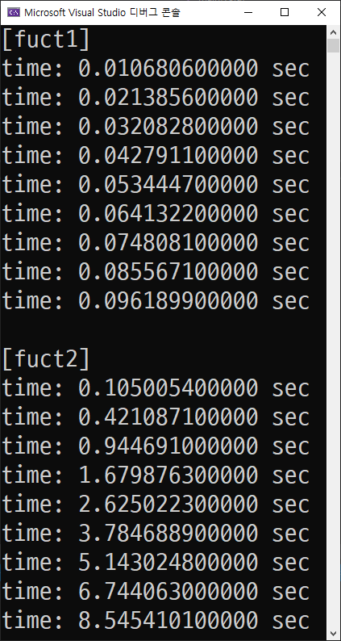

## 시간 복잡도

자료구조나 알고리즘을 배우면 기본적으로 시간 복잡도라는 개념이 나온다.

시간 복잡도는 컴퓨터 프로그램의 입력 값과 연산 수행 시간의 상관관계를 나타내는 척도이다. 주로 빅-오 표기법을 사용하는데 $O(n)$ , $O(n^2)$ , $O(n^3)$ 등이 있다.

예를 들어, 만약 크기 $n$의 모든 입력에 대해 알고리즘에 필요한 시간이 최대 $5n^2 + 3n$ 의 식을 가진다면, 이 알고리즘의 점근적 시간 복잡도는 $O(n^2)$ 이다.

이런 시간 복잡도를 가지는 프로그램을 구현해서 직접 실행 시간을 확인해보고, 측정하는 방법도 알아보자. C 언어를 통해 구현하고, 구현에 필요한 난수 발생 함수와 시간 측정 함수도 같이 작성할 예정이다.

## 난수 발생 함수

C 언어에서는 시스템 라이브러리를 통해 난수 발생 함수를 제공한다. 함수 `rand()` 가 **0 ~ RAND_MAX** 범위의 무작위 정수를 반환한다. 여기서 RAND_MAX는 rand()가 반환할 수 있는 최대 수이고, 이 값은 시스템마다 다를 수 있다.

난수 발생 함수를 사용하기 위해서는 헤더 파일 `stdlib.h` 가 필요하다. 이 헤더 파일에 rand()의 원형이 포함되어 있으면 rand()가 발생시킬 수 있는 최대 수인 RAND_MAX도 정의되어 있다.

```c
#include <stdio.h>
#include <stdlib.h>

int main(void)
{
	printf("%d\n", rand());

	return 0;
}
```

다음과 같이 난수를 발생시켜서 출력할 수 있다. 그러나 위 코드를 실행시켜 보면 계속 같은 난수가 나오는 것을 볼 수 있다. 이 문제를 해결하기 위해, 즉 매번 다른 난수를 발생시키기 위해 시드(seed) 값을 설정하는 방법이 있다. 시드 값을 달리하면 함수 rand()에서 발생시키는 난수가 매번 달라진다.

시드 값을 설정하기 위해 사용하는 함수가 바로 `srand()` 이다. srand()는 이를 호출할 때 전달하는 인자를 기반으로 하여 난수를 초기화시키는 역할을 한다.

srand()의 인자로 함수 time()을 많이 사용한다. time()은 인자로 NULL을 전달하면 1970년 1월 1일 0시 이후 현재까지 흐른 초 수를 반환한다. 시간은 멈추지 않고 계속해서 흐르므로 time() 함수가 반환한 현재의 초 수를 인자로 하여 srand()를 호출하면 난수 기준 값이 무작위라 할 수 있는 현재 초 수로 초기화된다. 따라서 srand(time(NULL))과 같이 호출하면 된다.

참고로 time()을 사용하기 위해서는 헤더 파일 `time.h` 가 필요하다.

```c
#include <stdio.h>
#include <stdlib.h>
#include <time.h>

int main(void)
{
	srand(time(NULL));

	printf(“% d\n”, rand());

	return 0;
}
```

## 시간 측정 함수

라이브러리 함수 가운데 일반적인 시간 측정 함수인 clock()을 사용하면 시간이 정밀하게 나오지 않는 문제가 발생한다. 대안으로 `QueryPerformanceCounter()` 함수를 사용하면 정밀한 시간을 출력할 수 있다.

구체적인 사용 방법은 헤더 파일로 `Windows.h` 를 추가한 후, LARGE_INTEGER 변수를 선언하고, QueryPerformanceFrequency() 함수를 통해 타이머의 주파수를 변수에 저장한 후, 시간을 측정하고 싶은 작업의 전후에 QueryPerformanceCounter()를 호출하고 그 반환 값들을 이용하여 계산하면 된다.

작동 원리는 메인보드에 고해상도의 타이머가 존재하는데 이를 이용하여 특정 실행 시점들의 CPU 클럭수들을 얻어온 후 그 차이를 이용하여 작업 시간을 구한다. clock() 함수와 달리 1us 이하의 시간까지 측정한다.

- QueryPerformanceFrequency() : 타이머의 주파수(초당 진동수)를 얻는 함수
- QueryPerformanceCounter() : 타이머의 CPU 클럭수를 얻는 함수

작업 전후의 클럭수 차를 주파수로 나누면 작업 시간(s)을 구할 수 있고, ms단위로 출력하기 위해선 결과 값에 1,000을 곱해주면 된다.

clock() 함수와 비교 했을 때 clock()은 초당 1,000번의 측정을 통해 1ms의 시간을 측정할 수 있는 데 비해, QueryPerformanceCounter()는 초당 10,000,000번의 측정으로 0.1us의 시간까지 측정할 수 있다. 초당 클럭수는 time.h를 헤더로 추가한 후 CLOCKS_PER_SEC을 출력하여 알 수 있고, 타이머의 주파수는 QueryPerformanceFrequency()를 통해 알 수 있다.

```c
#include <stdio.h>
#include <Windows.h>

int main(void)
{
	LARGE_INTEGER ticksPerSec;
	LARGE_INTEGER start, end, diff;

	QueryPerformanceFrequency(&ticksPerSec);
	QueryPerformanceCounter(&start);
	// 시간을 측정하고 싶은 작업(예: 함수 호출)을 이곳에 삽입
	QueryPerformanceCounter(&end);

	// 측정값으로부터 실행시간 계산
	diff.QuadPart = end.QuadPart – start.QuadPart;

	printf("time: %.12f sec\n\n", ((double)diff.QuadPart / (double)ticksPerSec.QuadPart));

	return 0;
}
```

## $O(n)$ VS $O(n^2)$

이제 앞서 말한 난수 발생 함수와 시간 측정 함수를 이용하여 $O(n)$ 시간 복잡도를 가지는 함수와 $O(n^2)$ 시간 복잡도를 가지는 함수를 비교해볼 예정이다.

우선 $O(n)$ 시간 복잡도를 가지는 함수는 다음과 같다.

```c
void func1(int *array, int n)
{
	int sum = 0;

	for (int i = 0; i < n; i++)
		sum += array[i];

	return;
}
```

다음은 $O(n^2)$ 시간 복잡도를 가지는 함수이다.

```c
void func2(int *array, int n)
{
	int sum = 0.0;

	for (int i = 0; i < n; i++)
		for (int j = 0; j <= i; j++)
			sum += array[j];

	return;
}
```

시간 복잡도를 보고 시간 측정 결과를 예측해볼 수 있다. $O(n)$의 시간 복잡도는 데이터 양이 증가할수록 linear-scale로 증가하고, $O(n^2)$ 의 시간 복잡도는 데이터 양이 증가할수록 log-scale로 증가한다.

이제 직접 코드로 구현해볼 차례이다. 코드는 다음과 같이 작동한다.

1. 10,000,000 크기의 정수형 배열에 난수 발생 함수를 이용하여 0 ~ 9,999,999의 정수 값을 채운다.

2. func1 함수는 인자 값을 1,000,000부터 10,000,000까지 1,000,000씩 증가시켜서 시간을 측정한다.

3. func2 함수는 인자 값을 10,000부터 100,000까지 10,000씩 증가시켜서 시간을 측정한다.

```c
#include <stdio.h>
#include <stdlib.h>
#include <time.h>
#include <Windows.h>

void func1(int *array, int n)
{
	int sum = 0;

	for (int i = 0; i < n; i++)
		sum += array[i];

	return;
}

void func2(int *array, int n)
{
	int sum = 0.0;

	for (int i = 0; i < n; i++)
		for (int j = 0; j <= i; j++)
			sum += array[j];

	return;
}

int main(void)
{
	int n = 10000000;
	int *array = (int *)malloc(sizeof(int) * n);

	LARGE_INTEGER ticksPerSec;
	LARGE_INTEGER start, end, diff;

	srand(time(NULL));

	for (int i = 0; i < n; i++)
		array[i] = rand() % n;

	printf("[func1]\n");
	for (int i = 1000000; i < 10000000; i += 1000000)
	{
		QueryPerformanceFrequency(&ticksPerSec);
		QueryPerformanceCounter(&start);
		func1(array, i);
		QueryPerformanceCounter(&end);

		diff.QuadPart = end.QuadPart - start.QuadPart;
		printf("time: %.12f sec\n", ((double)diff.QuadPart / (double)ticksPerSec.QuadPart));
	}

	printf("\n[func2]\n");
	for (int i = 10000; i < 100000; i += 10000)
	{
		QueryPerformanceFrequency(&ticksPerSec);
		QueryPerformanceCounter(&start);
		func2(array, i);
		QueryPerformanceCounter(&end);

		diff.QuadPart = end.QuadPart - start.QuadPart;
		printf("time: %.12f sec\n", ((double)diff.QuadPart / (double)ticksPerSec.QuadPart));
	}

	return 0;
}
```

위 코드를 실행시켜보면 측정되는 시간은 다음과 같다.



## 정리

결국, 예상했던 것처럼 시간이 측정되었다. 물론 정확한 값들은 아니지만 func1은 $0.01, 0.02, 0.03 ...$ 등으로 **linear-scale**로 커지는 것을 볼 수 있고, func2는 $0.1, 0.4, 0.9 ...$ 등으로 **log-scale**로 커지는 것을 볼 수 있다.

여러 외부 요인들로 인해 정확한 시간을 측정하는 것은 불가능하지만 시간 복잡도에 따라 시간이 증가하는 차이는 가시적으로 확인할 수 있었다.

예시에서는 간단한 함수를 사용했지만 난수 발생 함수와 시간 측정 함수를 이용해서 여러 알고리즘을 분석해볼 수 있다.
