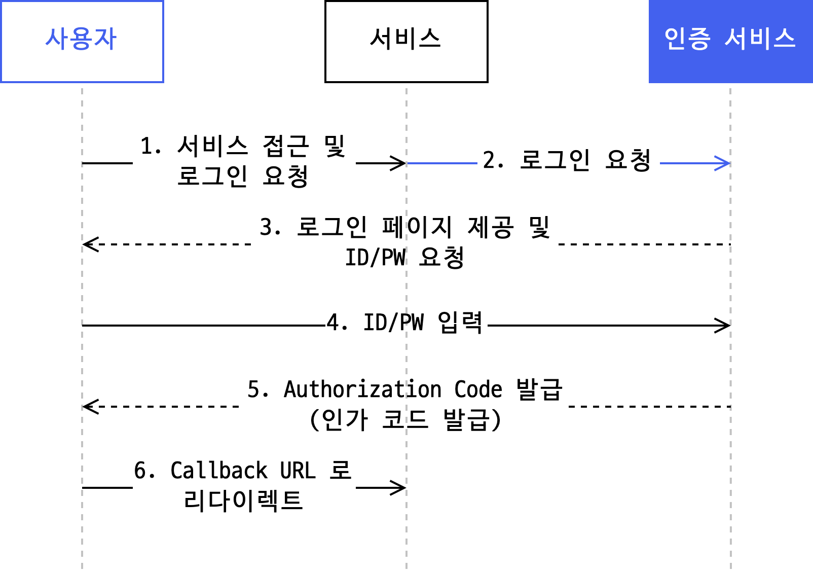
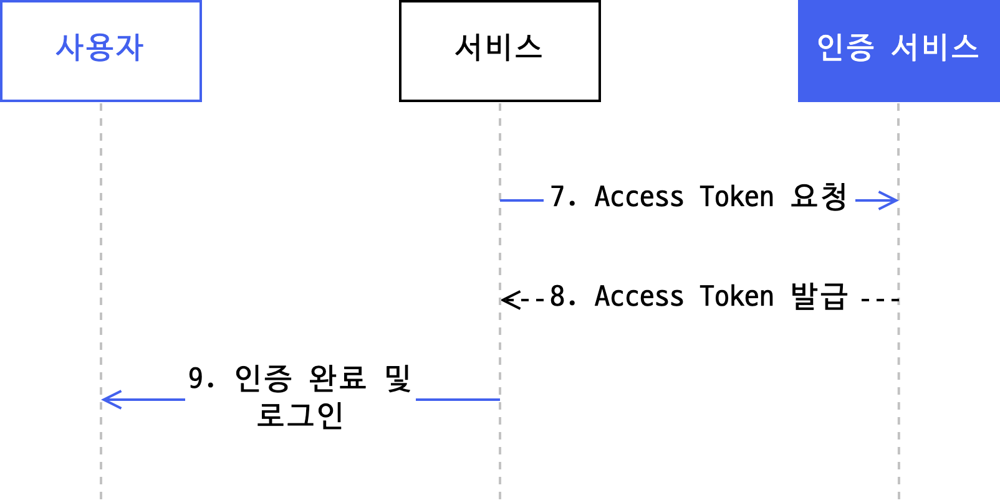
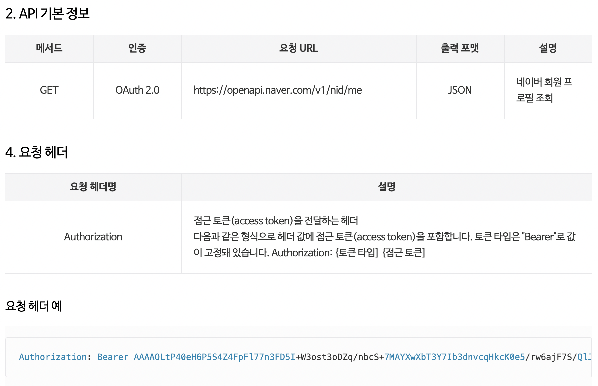

## OAuth 2.0

OAuth([RFC6749](https://datatracker.ietf.org/doc/html/rfc6749))는 사용자들이 비밀번호를 제공하지 않고, 다른 서비스에 있는 자신의 정보에 접근 권한을 부여하는 인터넷 표준이다.

쉽게 생각해서 서비스를 이용할 때 카카오, 네이버 등을 통한 간편 로그인을 떠올리면 된다.

## OAuth의 배경

우리의 서비스에서 카카오와 네이버의 간편 로그인을 구현하려고 한다고 해보자.

사용자가 카카오나 네이버의 회원임을 어떻게 증명할 수 있을까? 가장 쉬운 방법은 사용자에게 아이디와 비밀번호를 받아서 로그인해 보면 된다. 하지만 보안상 굉장히 취약한 구조이고, 사용자 입장에서 아이디와 비밀번호를 제3자 애플리케이션에 제공하는 것은 부담된다.

그렇다면 카카오나 네이버에 우리 서비스를 이용하려는 사용자가 회원임을 증명해달라고 하면 어떨까? 좋은 방법이다. 사용자는 우리에게 아이디와 비밀번호를 제공하지 않고, 카카오나 네이버의 회원임을 증명해 주기만 하면 된다.

초기에 회사들은 각자의 방법대로 회원임을 증명해주기 시작했다. 그러나 회사마다 다른 증명 방법은 제3자 애플리케이션에서 코드 복잡도를 높이고, 관리하기 어렵게 만들었다. 그래서 이러한 증명 방법을 하나로 통일해 인터넷 표준으로 만든 것이 `OAuth` 다.

## Authorization Code 받기

사용자가 우리 서비스에 카카오나 네이버에 회원임을 증명하는 프로세스는 다음과 같다.

1. 사용자는 우리 서비스에 간편 로그인 요청을 보낸다.
2. 우리 서비스는 카카오나 네이버의 인증 서비스에 로그인 요청을 보낸다.
3. 인증 서비스는 로그인 페이지를 제공해준다.
4. 사용자가 로그인 페이지에 아이디와 패스워드를 입력한다.
5. 인증 서비스는 아이디와 패스워드를 검증하고, 문제가 없다면 `Authroziation Code` 를 발급해준다.
6. 사용자는 받아온 Authorization Code를 우리 서비스에 전달해준다.

프로세스를 간단하게 하기 위해서 우리 서비스의 Callback URL을 통해 바로 Authorization Code를 보낸다. **이 과정에서 XSS(Cross-Site Scripting) 공격 등으로 Callback URL이 피싱 사이트로 변조될 수 있는데 대부분의 인증 서비스는 등록된 Callback URL로만 Authorization Code를 보내주도록 관리하고 있다.**

## Access Token 받기

우리 서비스에서 Authorization Code를 받은 이후에는 OAuth에서 가장 중요한 부분인 `Access Token` 을 발급 받는 프로세스가 진행된다.

7. 인증 서비스에 Access Token을 요청한다. 이 과정에서 받아온 Authorization Code와 인증 서비스에서 우리 서비스를 확인하기 위한 정보(Client Id, Client Secret 등)를 추가로 보낸다.
8. 인증 서비스는 우리 서비스에서 보낸 정보를 검증하고, `Access Token`을 발급한다. 우리 서비스는 보통 이 과정에서 받아온 Access Token을 안전한 장소에 보관해놓는다.
9. 우리 서비스는 클라이언트에 성공적으로 로그인 되었음을 알려준다.

Access Token은 발급해준 인증 서비스만 알 수 있는 임의의 문자열이다. Access Token은 사용자에 접근할 수 있는 열쇠라고 생각하면 된다. 이제 API 서비스에 이 열쇠를 보내서 사용자의 정보를 가져올 수 있다.

물론 JWT([RFC7519](https://datatracker.ietf.org/doc/html/rfc7519))로 Access Token을 발급했다면 `Base64`로 인코딩 되어있기 때문에 열어볼 수 있지만 `SIGNATURE` 검증은 인증 서비스에서만 할 수 있다.

Access Token을 발급할 때 `Refresh Token` 도 같이 발급하는 경우가 많다. Refresh Token은 만료 시간(expiration time)이 있는 Access Token을 앞서 소개한 복잡한 과정을 거치지 않고 재발급 받을 수 있는 열쇠라고 생각하면 된다. Access Token의 만료 시간은 OAuth 1.0에서 다루지 않다가 OAuth 2.0에서 정의 되었다.

## 사용자 정보 받기

저장된 Access Token으로 API 서비스에 요청을 보내서 사용자 정보에 접근할 수 있다.

10. 사용자가 우리 서비스에 요청을 보낸다. 다만, 우리 서비스에서 자체적으로 유저 정보에 접근하려는 경우 이 과정이 생략될 수 있다.
11. 우리 서비스는 저장된 Access Token과 함께 API 서비스에 요청을 보낸다.
12. API 서비스는 Access Token을 검증한 뒤에 이상이 없다면 요청에 응답한다.
13. 사용자가 우리 서비스에 요청을 보낸 경우에 응답해준다.

API 서비스에서 명세한대로 요청을 보내면 되고, 대부분 헤더에 `Authorization: Bearer ${access_token}` 을 실어서 보낸다.

## 정리

Authorization Code 받기 -> Access Token 받기 -> 사용자 정보 받기의 세 과정을 통해 사용자가 간편 로그인을 통해서 정보를 받아오는 과정까지 알아보았다. `OAuth 2.0` 은 인터넷 표준이기 때문에 다른 서비스도 비슷한 과정으로 진행될 것이라고 생각한다.

개인적으로 공부할 때 한 서비스의 인증 방식을 적용하면 다른 서비스를 적용하는 것은 어렵지 않았다. 오히려 적용한 이후에 토큰들을 어떻게 관리할지를 많이 고민했다.
