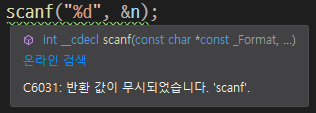

C 언어 프로그래밍을 하다 보면 입출력을 담당하는 printf 함수와 scanf 함수를 빼놓을 수가 없다.

그런데 놀랍게도 이 두 함수는 반환 값이 존재한다.


## scanf 함수의 반환 값

VS2019로 scanf 함수를 사용하면 반환 값이 무시되었다는 경고를 볼 수 있다.



그렇다면 scanf 함수의 반환 값은 무엇일까?

```c
#include <stdio.h>

int main(void)
{
  int n, m, a, b;

  a = scanf("%d", &n);
  b = scanf("%d %d", &n, &m);

  printf("%d\n", a);
  printf("%d\n", b);

  return 0;
}
```

다음 코드의 출력 값은 1과 2가 나온다.

두 scanf 함수의 차이점은 포맷 형식의 개수가 달라진 것뿐이라 반환 값을 예측할 수 있다. scanf 함수의 첫 번째 인자인 **포맷 형식의 개수가 scanf 함수의 반환 값**이다.

정확히는 포맷 형식에 알맞는 입력이 들어온 개수이다. 예를 들어 상단 코드에는 정수형을 입력받도록 포맷이 %d로 되어있는데 여기에 문자 'a'를 입력하면 개수가 늘어나지 않는다.

뿐만 아니라 scanf는 EOF(End Of File) 값도 반환한다. 콘솔 창에서 윈도우 계열은 Ctrl + Z, 유닉스 계열은 Ctrl + D를 통해 EOF가 입력되는데 이 경우에는 반환 값으로 EOF(-1)가 나오게 된다.

## printf 함수의 반환 값

그렇다면 printf의 반환 값은 무엇일까?

```c
#include <stdio.h>

int main(void)
{
  int n;

  n = printf("Hello World!\n");
  printf("%d\n", n);

  return 0;
}
```

다음 코드의 출력 값은 13이 나온다.

**printf 함수의 반환 값은 출력되는 문자의 개수**이다. 출력되는 문자의 개수는 공백( )과 이스케이프 시퀀스인 개행(\n), 가로 탭(\t) 등을 포함한다.
