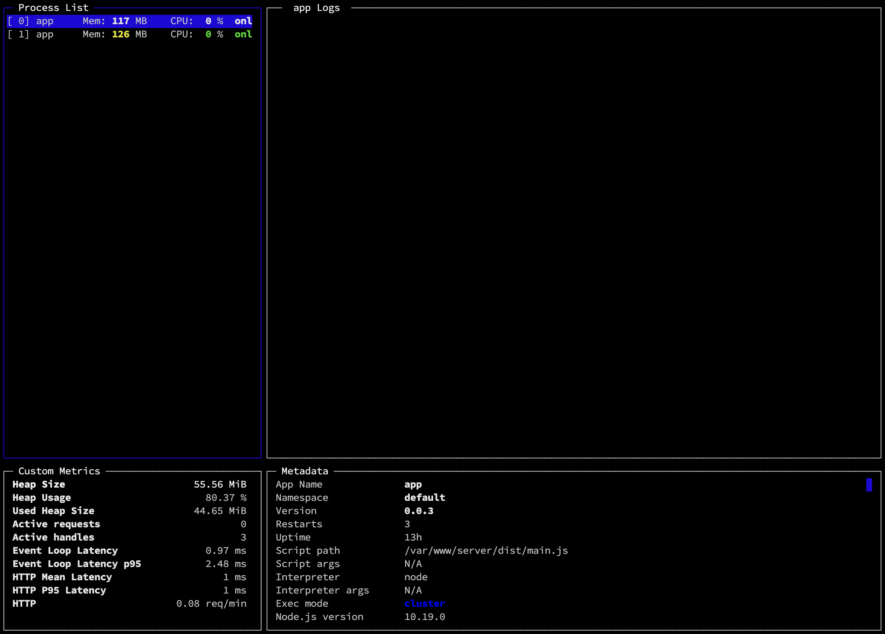

Node.js로 프로젝트를 마친 뒤에 서비스를 운영하려고 하면 크게 두 가지 고민에 빠진다.

1. 무중단 서비스 하기
2. 싱글 스레드 기반의 Node.js를 멀티 스레딩 혹은 하이퍼 스레딩으로 사용하기

이러한 고민을 PM2를 통해서 해결할 수 있다.

## PM2 란?

PM2는 `daemon process manager` 로 Node.js로 만들어진 프로그램의 프로세스을 편하게 관리할 수 있도록 도와준다.

## PM2 설치하기

간단하게 다음과 같은 명령어로 설치할 수 있다.

```shell session
$ npm install -g pm2
```

전역 설치라 권한 오류가 발생한다면 다음과 같은 명령어를 사용하면 된다.

```shell session
$ sudo npm install -g pm2
```

## PM2 사용하기

설치 후 다음과 같이 입력하면 현재 실행 중인 프로세스를 확인할 수 있다. 물론 처음에는 관리 중은 프로세스가 없어서 비어있는 리스트가 나타난다.

```shell session
$ pm2 list
```


id, name 등의 열들은 프로세스를 시작하면 직관적으로 어떤 것을 의미하는지 알 수 있다.

이제 다른 명령어들을 알아보자.

```shell session
$ pm2 start <서버 실행 파일>.js # 프로세스 실행
$ pm2 stop <id / name> # 프로세스 중지
$ pm2 restart <id / name> # 프로세스 재시작
$ pm2 delete <id / name> # 프로세스 삭제
$ pm2 logs # 프로세스 로그
$ pm2 monit # 프로세스 모니터링
```

이 중에서 `pm2 logs` 명령어는 Linux의 `tail -f` 명령어처럼 /home/ubuntu/.pm2/logs 에 존재하는 로그 파일들을 보여준다.

`pm2 monit` 명령어는 프로세스 별로 실시간 로그를 보여준다. 이밖에도 하단에 프로세스의 사용량과 정보들을 함께 제공한다.



## PM2 조금 더 유용하게 사용하기

`pm2 start` 명령어를 통해서 서버를 잘 운영하고 있었는데 트래픽이 급증했다고 해보자. 아무리 서버가 죽었을 때 바로 살리고, 내부 로직을 효율적으로 구현했다고 하더라도 싱글 스레드인 Node.js의 한계가 나타나기 시작한다. 이럴 때 PM2의 `cluster` 를 이용할 수 있다.

```shell session
$ pm2 start -i <클러스터링 개수 / max> <서버 실행 파일>.js # N개 혹은 max(최대 개수)로 프로세스 실행
```

등록한 개수만큼 PM2에 등록하고, `Load Balancing(LB)` 를 통해 부하를 분산시켜준다. Load Balancing은 `round robin(RB)` 방식으로 동작한다. 옵션 하나만 추가해주면 PM2가 알아서 프로세스를 구성해준다.


무중단으로 서버를 재시작하고 싶다면 다음과 같은 명령어를 사용한다.

```shell session
$ pm2 reload all
```

뿐만 아니라 다음과 같은 명령어로 프로젝트의 변경 사항을 감지해서 서버를 자동으로 리로드 해줄 수도 있다.

```shell session
$ pm2 start --watch <서버 실행 파일>.js
```

[공식 사이트](https://pm2.keymetrics.io/)를 참고하면 더 많은 명령어를 알 수 있다.

## PM2 조금 더 편리하게 사용하기

일일이 옵션 명령어를 주는 것이 귀찮다면 `.js` 파일을 통해 사용할 수 있다.

```js
// ecosystem.config.js

module.exports = {
  apps: [
    {
      name: 'app', // 프로세스 이름
      script: 'dist/main.js', // 프로세스 실행 파일
      instances: 2, // cluster할 개수
      exec_mode: 'cluster', // 실행 모드
    },
  ],
}
```

파일에서 옵션 설정을 해줬다면 다음과 같은 명령어로 PM2를 이용하면 된다.

```shell session
$ pm2 start ecosystem.config.js
```
