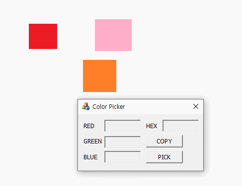
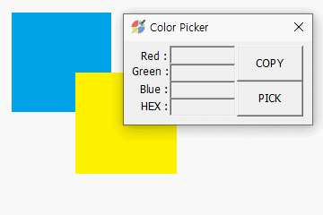

## MFC 토이 프로젝트

학교에서 계절학기 강의로 MFC 수업을 들으면서 C++ MFC 라이브러리와 MySQL을 이용해서 도서 관리 시스템을 개발했다. 처음에 MFC가 되게 복잡하다고 느껴져서 관두고 싶었다. 그런데 막상 하다보니까 나름 할만했다. 예전에 Java Swing으로 했던 프로젝트도 생각나고 그때보다 편한 점도 많이 느꼈다. 예를 들면 비주얼 스튜디오 상에서 뷰 화면을 통해 컨트롤들을 직접 조작하거나(물론 Java Swing WindowBuilder나 JavaFX SceneBuilder가 있지만 당시에 사용을 안했다), 리소스 파일을 추가하는게 간편했다. 그렇게 나름 MFC의 매력을 느끼면서 프로젝트를 끝마쳤다.

## 그렇게 시작된 프로젝트

프로젝트를 마치고 나니까 예전에 얼핏 생각했던 프로그램을 만들고 싶었다. 모니터 화면에 보이는 부분의 색상 정보를 가져오는 프로그램이다. PPT나 프로그램 UI를 만들 때 간혹 괜찮은 색상을 발견했을 때 색상 정보를 알 수가 없어서 답답했던 적이 있다. 그래서 MFC 라이브러리를 배운 김에 간단히 만들어보기로 했다.

## 개발을 시작하면서


UI는 위에 나와 있는 것처럼 간단하게 구상했다. 메인 화면에서 Pick 버튼을 누르면 오른쪽 Pick 화면으로 변경되고, Pick 화면은 마우스 커서를 따라다니면서 커서가 위치한 곳의 색상 정보를 RGB 형식으로 보여주게 했다. 커서를 클릭하면 해당 위치의 색상 정보가 메인 화면에 뿌려지게 되고, Copy버튼을 누르면 HEX 값으로 색상 정보가 복사되게 했다. 단순히 클릭을 통해서 색상 정보만 가져오면 되기 때문에 두 시간 정도 투자하면 완성할 줄 알았다. 그런데 무려 하루나 걸렸다!

## 하루나 걸린 이유

우선 마우스 커서에 위치한 색상 정보는 가져오는 방법은 아주 간단히 해결했다.

```cpp
colorDlg->SetWindowPos(NULL, pMouse->pt.x + 5, pMouse->pt.y + 5, 0, 0, SWP_NOSIZE);

COLORREF color = GetPixel(GetDesktopWindow()->GetDC()->GetSafeHdc(), pMouse->pt.x, pMouse->pt.y);
colorDlg->color = color;
```

그런데 **커서가 프로그램을 벗어나는 순간 더 이상 커서에 해당하는 색상 정보를 가져오지 못했다.** 이 문제를 해결하기 위해서 여러가지 방법을 시도해봤다.

1.  SetCapture(), ReleaseCapture()  
    이 방법을 사용하면 마우스가 다이얼로그 밖으로 나가도 색상 정보를 가져올 수 있었다. 다만, 마우스가 다이얼로그 안에서 눌린 상태로 밖으로 벗어났을 때만 마우스 메시지를 전달하기 때문에 내가 구현하려고 하는 프로그램에는 적합하지 않았다. 다이얼로그 밖에서 클릭했을 때 원하는 위치의 색상 정보를 가져오려고 했기 때문이다.
2.  전체 화면(SW_MAXIMIZE)과 배경 투명화(transparent)  
    메인 화면에서 Pick을 누르는 순간 메인 화면을 전체 크기로 변경하고, 배경을 투명하게 해서 마우스 커서가 화면 밖으로 벗어나지 않고 선택할 수 있게 했다. 결론적으로는 내가 생각한대로 동작했다. 그런데 Pick 버튼을 눌렀을 때 화면이 최대화 되고, 화면을 클릭했을 때 원래 크기로 돌아오면서 동작이 매우 부자연스러웠다. 화면이 깜빡거리고, 색을 고를 때 따라오는 다이얼로그의 움직임도 보기 안좋았다.



더 이상 방법이 없는 것 같아서 여기서 프로젝트를 마무리할까하다가 너무 찜찜해서 해결 방법을 다시 검색해봤다. 그러다가 후킹(hooking)이라는 것을 알게 되었다.

## 후킹(Hooking)

> 후킹(hooking)은 소프트웨어 공학 용어로, 운영 체제나 응용 소프트웨어 등의 각종 컴퓨터 프로그램에서 소프트웨어 구성 요소 간에 발생하는 함수 호출, 메시지, 이벤트 등을 중간에서 바꾸거나 가로채는 명령, 방법, 기술이나 행위를 말한다.

전역 후킹을 이용하면 훅이 걸려있는 동안 모든 마우스나 키보드의 메시지를 중간에 가로챌 수 있다. 이런 방법이 있는 줄 몰랐고, 알게 되어서 너무 좋았다.

```cpp
// SetHook
g_hModule = GetModuleHandle(NULL);
if (NULL != g_hModule)
{
	g_hMouse = SetWindowsHookEx(WH_MOUSE_LL, MouseProc, g_hModule, NULL);
}

if (NULL == g_hMouse)
	AfxMessageBox(_T("Mouse Hook Fail"));

// UnHook
BOOL bMouseUnHook = UnhookWindowsHookEx(g_hMouse);

if (TRUE == bMouseUnHook)
{
	g_hMouse = NULL;

	FreeLibrary(g_hModule);
	g_hModule = NULL;
}
```

Pick 버튼을 누르면 SetHook 통해서 후킹을 했고, 색 선택이 완료되면 UnHook을 통해서 후킹을 해제했다. UnHook을 하지 않으면 Pick 버튼을 누를 때마다 후킹을 해서 윈도우 자체가 느려지기 때문에 반드시 UnHook을 해줬다. 사실 지금 사용한 후킹은 가장 낮은 단계에 후킹이라고 한다. 그래도 내가 설계한 프로그램을 구현하는데는 큰 문제가 없었다. 나중에 기회가 되면 다른 후킹도 한번 공부해봐야겠다.

결과적으로 내가 계획했던 프로그램대로 완성이 되었고, 버벅임 없이 잘 동작했다. 하루 동안 진행한 간단한 프로젝트지만 여러가지를 배울 수 있어서 좋았다.



## 소스코드

[doputer/ColorPicker](https://github.com/doputer/ColorPicker)
