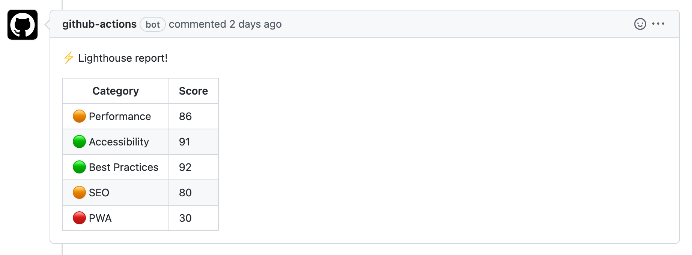

## 서비스가 사용자에게 닿기까지

[Knoticle](https://github.com/boostcampwm-2022/web01-knoticle) 서비스를 개발하면서 GitHub Actions로 CI/CD를 구성한 경험을 공유합니다.

개발부터 배포까지 아래와 같은 과정을 거쳤습니다.

1. 코드 통일하기

- Eslint로 코드 스타일 검사
- 팀원들의 코드가 통일된 스타일을 유지하는지 확인

2. 동작 확인하기

- 빌드를 통해 코드가 정상적으로 작동하는지 확인
- 새로운 코드가 기존 서비스와 잘 통합되는지 확인

3. 지표 확인하기

- Lighthouse로 성능 지표 점검
- 일정 수준의 서비스 품질을 유지하기 위한 지표 확보

4. 서비스 제공하기

- 테스트를 통과한 코드를 클라우드에 배포
- 무중단 배포로 사용자에게 지속적인 서비스 제공

## CI/CD 자동화

이 프로젝트에서는 매주 데모 시연을 하고 사용자 피드백을 빠르게 반영하기 위해 빈번한 배포가 필요했습니다.

수동 배포는 비효율적이었기 때문에 GitHub Actions를 사용해 배포 프로세스를 자동화하고 개발에 집중할 수 있도록 했습니다.

### 프론트엔드 CI

프론트엔드 CI는 main 브랜치와 develop 브랜치에 PR이 생성될 때 자동으로 수행됩니다.

```yaml
name: Frontend CI

on:
  pull_request:
    branches: [main, develop]
    paths:
      - 'frontend/**'
```

이후 Eslint 검사, Lighthouse 검사를 수행합니다.

```yaml
jobs:
  lint: ...
  lighthouse: ...
```

GitHub Actions에서 job은 독립적으로 실행하는 단위입니다. job에 들어있는 작업들은 병렬적으로 실행됩니다. 두 과정을 병렬 처리해서 CI 시간을 단축하고자했습니다.

이제 과정을 하나씩 보겠습니다.

```yaml
lint:
  name: Lint CI

  runs-on: ubuntu-latest

  steps:
    - name: Checkout
      uses: actions/checkout@v3

    - name: Cache Dependencies
      uses: actions/cache@v3
      id: frontend-cache
      with:
        path: frontend/node_modules
        key: ${{ runner.OS }}-build-${{ hashFiles('**/package-lock.json') }}
        restore-keys: |
          ${{ runner.OS }}-build-
          ${{ runner.OS }}-

    - if: ${{ steps.frontend-cache.outputs.cache-hit != 'true' }}
      name: Install Dependencies
      run: npm install
      working-directory: frontend

    - name: Check Lint
      run: npm run lint
      env:
        CI: true
      working-directory: frontend
```

우선 lint job 입니다.

실제로 린트 검사를 수행하는 부분은 마지막에 있는 **Check Lint** 스텝입니다.

그런데 앞선 스텝들은 무엇일까요?

**Checkout** 스텝에서는 코드 저장소에 있는 코드를 CI 과정을 수행하는 서버로 내려받습니다.

이후 **Install Dependencies** 스텝에서 프론트엔드에서 사용하는 모듈을 설치합니다. 이때 모듈들은 설치하는데 오래 걸리기도 하고 자주 변경되지 않기 때문에 캐싱해놓기 적절해보입니다.

그래서 설치 과정 바로 직전 스텝인 **Cache Dependencies**에서 모듈 캐싱을 수행합니다. 모듈을 설치하면 변경되는 `package-lock.json` 파일 내용을 키로 만들어서 파일이 변경되었을 때만 모듈을 설치하고 변경되지 않았다면 GitHub에 저장해놓은 모듈 설치 파일을 꺼내다 씁니다.

```yaml
lighthouse:
  name: Lighthouse CI

  runs-on: ubuntu-latest

  steps:

    ... (생략)

    - name: Run Lighthouse CI
      env:
        LHCI_GITHUB_APP_TOKEN: ${{ secrets.LHCI_GITHUB_APP_TOKEN }}
      run: |
        npm install -g @lhci/cli
        lhci autorun
      working-directory: frontend

    - name: Format Lighthouse Score
      id: format_lighthouse_score
      uses: actions/github-script@v3
      with:
        github-token: ${{secrets.GITHUB_TOKEN}}
        script: |
          const fs = require('fs');

          const results = JSON.parse(fs.readFileSync('frontend/lighthouse_reports/manifest.json'));

          const summaryTotal = {};

          results.forEach((result) => {
            const { summary } = result;

            const formatResult = (res) => Math.round(res * 100);

            Object.keys(summary).forEach((key) => {
              if (key in summaryTotal) summaryTotal[key] += formatResult(summary[key]);
              else summaryTotal[key] = formatResult(summary[key]);
            });
          });

          Object.keys(summaryTotal).forEach((key) => {
            summaryTotal[key] = Math.round(summaryTotal[key] / results.length);
          });

          const score = (res) => (res >= 90 ? '🟢' : res >= 50 ? '🟠' : '🔴');

          const comment = [
            `⚡️ Lighthouse report!`,
            `| Category | Score |`,
            `| --- | --- |`,
            `| ${score(summaryTotal.performance)} Performance | ${summaryTotal.performance} |`,
            `| ${score(summaryTotal.accessibility)} Accessibility | ${summaryTotal.accessibility} |`,
            `| ${score(summaryTotal['best-practices'])} Best Practices | ${summaryTotal['best-practices']} |`,
            `| ${score(summaryTotal.seo)} SEO | ${summaryTotal.seo} |`,
            `| ${score(summaryTotal.pwa)} PWA | ${summaryTotal.pwa} |`,
          ].join('\n');

          core.setOutput('comment', comment)

    - name: Comment Lighthouse Report
      uses: unsplash/comment-on-pr@v1.3.0
      env:
        GITHUB_TOKEN: ${{ secrets.GITHUB_TOKEN }}
      with:
        msg: ${{ steps.format_lighthouse_score.outputs.comment}}
```

다음은 lighthouse job 입니다.

**Run Lighthouse CI** 스텝에서 Lighthouse 검사를 수행합니다.

```js .lighthouserc.js
module.exports = {
  ci: {
    collect: {
      startServerCommand: 'npm run start',
      url: ['http://localhost:3000'],
      numberOfRuns: 3,
    },
    upload: {
      target: 'filesystem',
      outputDir: './lighthouse_reports',
      reportFilenamePattern: '%%PATHNAME%%-%%DATETIME%%-report.%%EXTENSION%%',
    },
  },
};
```

위와 같이 사전에 정의했던 방법대로 검사를 수행합니다. 한 번만 검사를 수행하지 않고 `numberOfRuns`에 따라 세 번의 검사를 수행합니다.

검사를 수행했다면 다음과 같은 요약 보고서 파일을 확인할 수 있습니다.

```json lighthouse_reports/manifest.json
[
  {
    "url": "http://localhost:3000/",
    "isRepresentativeRun": false,
    "htmlPath": "/Users/dohyeon/Development/knoticle/frontend/lighthouse_reports/_-2022_11_26_12_40_53-report.html",
    "jsonPath": "/Users/dohyeon/Development/knoticle/frontend/lighthouse_reports/_-2022_11_26_12_40_53-report.json",
    "summary": {
      "performance": 0.98,
      "accessibility": 0.94,
      "best-practices": 0.92,
      "seo": 0.8,
      "pwa": 0.3
    }
  },
  ...
]
```

이런 보고서를 PR 코멘트로 확인할 수 있다면, 작업 과정마다 지표로 삼을 수 있겠죠?

뒤에 **Format Lighthouse Score** 스텝과 **Comment Lighthouse Report** 스텝에서는 보고서를 포매팅해서 코멘트로 남겨주는 작업을 수행합니다.



### 백엔드 CI

백엔드의 CI도 프론트엔드와 마찬가지로 main 브랜치와 develop 브랜치에 PR이 생성되면 수행됩니다.

```yaml
name: Backend CI

on:
  pull_request:
    branches: [main, develop]
    paths:
      - 'backend/**'

jobs:
  lint: ...

  build: ...
```

동일한 과정을 수행하기 때문에 생략하겠습니다.

### 프론트엔드 & 백엔드 CD

CI 과정을 마치고 나면 CD 과정을 수행합니다.

nCloud 서비스에 접속해서 빌드하고 PM2 reload를 통해서 무중단 실행하는 과정입니다.

프론트엔드와 백엔드가 동일한 CD 과정을 수행하기 때문에 프론트엔드 기준으로만 설명하겠습니다.

```yaml
name: Frontend CD

on:
  push:
    branches: [main]
    paths:
      - 'frontend/**'

jobs:
  deploy:
    runs-on: ubuntu-latest

    steps:
      - name: Generate Environment Variables
        run: |
          echo "$FRONTEND_ENV" >> .env.production
        env:
          CI: false
          FRONTEND_ENV: '${{ secrets.FRONTEND_ENV }}'

      - name: Transfer Environment Variables with SCP
        uses: appleboy/scp-action@master
        with:
          host: ${{ secrets.SSH_HOST }}
          username: ${{ secrets.SSH_USERNAME }}
          password: ${{ secrets.SSH_PASSWORD }}
          port: ${{ secrets.SSH_PORT }}
          source: '.env.production'
          target: 'knoticle/frontend'

      - name: Deploy
        uses: appleboy/ssh-action@v0.1.4
        with:
          host: ${{ secrets.SSH_HOST }}
          username: ${{ secrets.SSH_USERNAME }}
          password: ${{ secrets.SSH_PASSWORD }}
          port: ${{ secrets.SSH_PORT }}
          script: ${{ secrets.SSH_FRONTEND_SCRIPT }}
```

**Generate Environment Variables** 스텝에서는 GitHub Secrets에 저장된 환경 변수를 생성하는 과정입니다.

이후 **Transfer Environment Variables with SCP** 스텝에서 SCP(Secure Copy)를 통해 nCloud 서버에 환경 변수를 보내게 됩니다. 환경 변수는 원격 저장소에 저장되지 않기 때문에 이런식으로 관리할 수 있습니다.

마지막으로 **Deploy** 스텝에서 nCloud에 접속해서 코드를 빌드하고 무중단 실행하는 과정을 거칩니다.

## 고민해볼 사항

- Lighthouse 외에 [PageSpeed Insights](https://pagespeed.web.dev/)를 고려할 수 있습니다. 이곳에서는 웹 페이지에서 사용자의 환경 품질에 대한 평가 점수를 제공합니다.
- CI에 테스트 코드를 실행하는 과정도 포함해 볼 수 있습니다.

## 참고 자료

- [Lighthouse CI를 알아보고 Github Actions에 적용하기](https://fe-developers.kakaoent.com/2022/220602-lighthouse-with-github-actions/)
