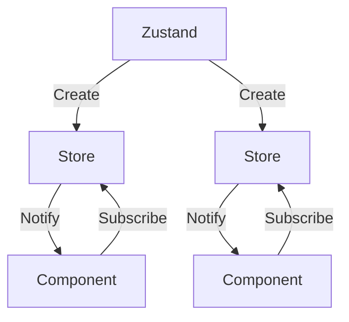

import Example1 from '#/create-state-store/example/example1';
import Example2 from '#/create-state-store/example/example2';
import Example3 from '#/create-state-store/example/example3';
import Example4 from '#/create-state-store/example/example4';

라이브러리의 동작 원리를 이해하는 방법에는 어떤 것들이 있을까요? 여러가지가 있겠지만 다시 만들어보는 것도 그 중 하나라고 생각합니다.

자주 사용하는 상태 관리 라이브러리 중 하나인 `Zustand`를 직접 만들어보면서 어떤 문제를 해결해나갔는지 생각을 따라가봤습니다.

## Zustand의 동작 방식

`Zustand`는 어떻게 동작하고, 또 `React`는 어떻게 상태를 전달받을 수 있을까요?

간단히 말하자면 `React`는 `Zustand`가 만든 상태 저장소를 `useSyncExternalStore`를 통해 구독하는 구조입니다.

1. `Zustand`가 상태 저장소 생성
2. `React`가 `useSyncExternalStore`로 상태 저장소 구독
3. 상태가 변경되면 `Zustand`가 모든 구독자에게 알림
4. `React`가 변경을 감지하고 컴포넌트를 리렌더링

플로우 차트로는 아래와 같이 표현할 수 있습니다.



이제 이 흐름을 코드로 표현해보겠습니다.

## 기본 상태 저장소

가장 먼저 최소한의 기능만 가진 단순한 저장소를 만들어보겠습니다.

우선 아래 세 가지 인터페이스를 갖는 저장소를 만들어줍니다.

1. 값을 반환할 수 있다.
2. 값을 변경할 수 있다.
3. 값이 변경됐음을 알릴 수 있다.

```ts basic-store.ts
type Store<T> = {
  getState: () => T;
  setState: (value: T) => void;
  subscribe: (listener: () => void) => () => void;
};

export const createStore = <T>(initialState: T) => {
  let state = initialState;
  const listeners = new Set<() => void>();

  const getState: Store<T>['getState'] = () => {
    return state;
  };

  const setState: Store<T>['setState'] = (value) => {
    const nextState = value;

    if (Object.is(nextState, state)) return;

    state = nextState;

    listeners.forEach((listener) => listener());
  };

  const subscribe: Store<T>['subscribe'] = (listener) => {
    listeners.add(listener);

    return () => listeners.delete(listener);
  };

  return { getState, setState, subscribe };
};
```

`createStore` 함수는 요구 사항대로 세 가지 인터페이스를 반환합니다.

생각보다 단순한 구조인데요. 한가지 특징은 내부에 있는 `state`는 노출하지 않고, 대신 클로저를 이용해서 안전하게 관리합니다.

이제 이 저장소를 `React`가 구독할 수 있도록 만들겠습니다.

공식 문서의 [useSyncExternalStore](https://ko.react.dev/reference/react/useSyncExternalStore)를 읽어보면, `subscribe` 함수는 스토어를 구독하고, 구독을 취소하는 함수를 반환해야하고, `getSnapshot` 함수는 스토어에서 데이터의 스냅샷을 읽어와야한다고 되어있습니다.

이에 맞게 메소드들을 넣어줍니다.

```ts basic-store.ts
export const useStore = <T>(store: Store<T>) => {
  const slice = useSyncExternalStore(store.subscribe, store.getState);

  return slice;
};
```

이제 저장소는 상태가 변경되면 `React`에 알리게 되고, `React`는 새로운 상태 스냅샷을 `Object.is`로 비교해서 변경되었을 때 컴포넌트를 리렌더링할 수 있게 되었습니다.

벌써 기본 상태 저장소를 완성했는데요. 이제 이걸 이용해서 간단한 카운터 컴포넌트를 만들어서 사용해보겠습니다.

```tsx Counter.tsx
const store = createStore(0);

const Counter = () => {
  const value = useStore(store);

  const increase = () => {
    store.setState(store.getState() + 1);
  };

  return (
    <>
      <div>Value: {value}</div>
      <button onClick={increase}>Increase Button</button>
    </>
  );
};
```

<Callout>
    `Increase Button`을 눌러서 변화를 확인해보세요.
</Callout>

<Example1 />

### 함수형 상태 업데이트

기존 저장소는 잘 동작하지만 새로운 값을 직접 전달하는 방식만 지원합니다. 하지만 이전 상태를 기반으로 다음 상태를 계산해야 하는 경우도 자주 있는데요.

예를 들어 `setState(state + 1)` 대신 `setState((prev) => prev + 1)`처럼 작성할 수 있으면 더 직관적입니다.

이를 위해 `setState` 함수를 아래처럼 확장할 수 있습니다.

```ts primitive-store.ts
const setState: Store<T>['setState'] = (value) => {
  // !mark(1:4)
  const nextState =
    typeof value === "function"
      ? (value as (state: T) => T)(state)
      : value;

  if (Object.is(nextState, state)) return;

  state = nextState;

  listeners.forEach((listener) => listener());
};
```

이제 아래와 같이 사용할 수 있습니다.

```tsx Counter.tsx
const increase = () => {
  store.setState(prev => prev + 1);
};
```

## 효율적인 상태 저장소

기존 저장소는 상태를 변경할 때마다 모든 구독자에게 알립니다. 원시 값일 땐 문제가 없지만 객체를 다룰 때는 불필요한 렌더링이 발생할 수 있습니다.

기존 저장소에 객체를 저장하고 객체의 일부만 변경해보겠습니다. `age`가 변경되면 `name`만 구독하고 있는 컴포넌트도 리렌더링 됩니다.

```tsx Person.tsx
const store = createStore({
  name: '김도현',
  age: 0,
});

const Name = () => {
  const { name } = useStore(store);

  return <div>Name: {name}</div>;
};

const Age = () => {
  const { age } = useStore(store);

  const increase = () => {
    store.setState((prev) => ({ ...prev, age: prev.age + 1 }));
  };

  return (
    <>
      <div>Age: {age}</div>
      <button onClick={increase}>Increase Button</button>
    </>
  );
};
```

<Example2 />

`Name` 컴포넌트를 `React.memo`로 감싸도 동일하게 리렌더링 되는데요. 리렌더링이 왜 발생하는지 생각해보면 소용이 없다는 걸 알 수 있습니다.

이유는 리렌더링 트리거가 `Name` 컴포넌트 내부에서 발생하는게 아니라 `useSyncExternalStore`에서 발생하기 때문입니다. 현재 저장소가 전체 객체를 구독하고 있어서 `age`만 바뀌어도 객체 참조가 새로워지고, `Name` 컴포넌트도 함께 리렌더링 됩니다.

이 문제를 해결하기 위해 `selector` 개념을 도입해보겠습니다. 핵심은 **`useSyncExternalStore`가 현재 상태를 읽는 함수(getSnapshot)의 결과를 기억한다는 점**입니다. 따라서 **무엇을 구독할지**만 조절해주면 불필요한 리렌더링을 막을 수 있습니다.

```ts selective-store.ts
type Selector<T, U = T> = (state: T) => U;

export const useStore = <T, U = T>(
  store: Store<T>,
  selector: Selector<T, U> = (state) => state as unknown as U
) => {
  const slice = useSyncExternalStore(
    store.subscribe,
    () => selector(store.getState()),
    () => selector(store.getState())
  );

  return slice;
};
```

<Callout>
    **제네릭 타입 `U`**

    `selector`는 객체에서 일부만 선택할 수 있기 때문에 이때 타입을 안전하게 추론하기 위해서 사용했습니다.

    `T`는 `Store`에서 추론되고 `U`는 `Selector`에서 추론됩니다.

    ```ts
    useStore(store) // T = { name: string; age: number }, U = T
    useStore(store, (state) => state.name) // T = { name: string; age: number }, U = string
    ```
</Callout>

이제 컴포넌트에서 객체의 원하는 값만 잘라서 구독할 수 있고, 불필요한 리렌더링도 발생하지 않습니다.

```tsx Person.tsx
const store = createStore({
  name: '김도현',
  age: 0,
});

const Name = () => {
  const name = useStore(store, (state) => state.name);

  return <div>Name: {name}</div>;
};

const Age = () => {
  const age = useStore(store, (state) => state.age);

  const increase = () => {
    store.setState((prev) => ({ ...prev, age: prev.age + 1 }));
  };

  return (
    <>
      <div>Age: {age}</div>
      <button onClick={increase}>Increase Button</button>
    </>
  );
};
```

<Example3 />

## 최적화된 상태 저장소

`selector`를 추가하면서 이제 필요한 부분만 구독할 수 있는 저장소가 되었습니다. 하지만 여전히 문제가 남아있는데요.

```ts
useStore(store, (state) => ({ name: state.name, age: state.age }));
```

이렇게 여러 값을 객체로 묶어서 반환하면 객체의 참조가 매번 새로 생성돼서 무한 리렌더링이 발생합니다.

`React`는 기본적으로 참조 동등성(Object.is)으로 상태 변화를 감지하기 때문에 다른 새로운 객체가 만들어질 때마다 `useSyncExternalStore`는 "값이 달라졌다" 라고 평가합니다.

이를 해결하기 위해 `shallow` 개념을 도입해보겠습니다. `React`의 코드를 바꿀 수는 없는 노릇이니 컴포넌트에서 객체의 값이 바뀌지 않았다면 동일한 참조를 가진 객체를 전달해주면 됩니다.

```ts use-shallow.ts
const equal = <T>(value1: T, value2: T) => {
  if (JSON.stringify(value1) === JSON.stringify(value2)) return true;

  return false;
};

export const useShallow = <T, U = T>(selector: Selector<T, U>) => {
  const prev = useRef<U>(null);

  return (state: T) => {
    const next = selector(state);

    return equal(prev.current, next) ? (prev.current as U) : (prev.current = next);
  };
};
```

<Callout>
    **JSON.stringify**

    여기선 간단하게 비교하기 위해 사용했습니다. 객체가 깊어지면 비효율적인 연산이 되기 때문에 `Zustand`에서는 자체 구현한 [shallow](https://github.com/pmndrs/zustand/blob/main/src/vanilla/shallow.ts) 함수를 통해서 비교 연산을 수행합니다.
</Callout>

이전 값을 `useShallow` 속 `prev`에 저장한 후 새로 들어오는 `next`와 비교해서 동일하다면 이전 값을 반환하고, 다르다면 새 값을 반환합니다.

이제 문제없이 객체의 여러 값을 한번에 구독할 수 있습니다.

```tsx Person.tsx
const store = createStore({
  name: '김도현',
  age: 0,
});

const Person = () => {
  const { name, age } = useStore(
    store,
    // !mark
    useShallow((state) => ({ name: state.name, age: state.age }))
  );

  const increase = () => {
    store.setState((prev) => ({ ...prev, age: prev.age + 1 }));
  };

  return (
    <>
      <div>Name: {name}</div>
      <div>Age: {age}</div>
      <button onClick={increase}>Increase Button</button>
    </>
  );
};
```

<Example4 />
