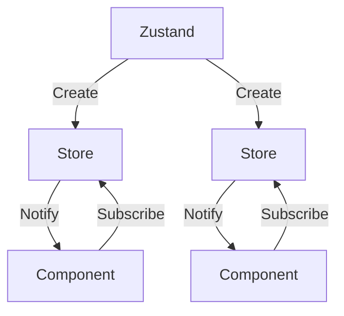

import Example1 from '#/create-state-store/example/example1';
import Example2 from '#/create-state-store/example/example2';
import Example3 from '#/create-state-store/example/example3';
import Example4 from '#/create-state-store/example/example4';

상태 관리 라이브러리 `Zustand`를 직접 구현하면서 동작 원리를 이해해 보겠습니다.

## Zustand의 동작 방식

`Zustand`는 어떻게 동작할까요? 간단히 말하면 `Zustand`가 상태 저장소를 만들고, `React`는 `useSyncExternalStore`를 통해 이를 구독하는 구조입니다.

1. `Zustand`가 상태 저장소 생성
2. `React`가 `useSyncExternalStore`로 상태 저장소 구독
3. 상태가 변경되면 `Zustand`가 모든 구독자에게 알림
4. `React`가 변경을 감지하고 컴포넌트를 리렌더링



## 기본 상태 저장소

먼저 최소한의 기능만 가진 단순한 저장소를 만들어보겠습니다.

세 가지 인터페이스를 갖는 저장소를 만듭니다.

1. 값을 반환할 수 있다.
2. 값을 변경할 수 있다.
3. 값이 변경됐음을 알릴 수 있다.

```ts basic-store.ts
type Store<T> = {
  getState: () => T;
  setState: (value: T) => void;
  subscribe: (listener: () => void) => () => void;
};

export const createStore = <T>(initialState: T) => {
  let state = initialState;
  const listeners = new Set<() => void>();

  const getState: Store<T>['getState'] = () => {
    return state;
  };

  const setState: Store<T>['setState'] = (value) => {
    const nextState = value;

    if (Object.is(nextState, state)) return;

    state = nextState;

    listeners.forEach((listener) => listener());
  };

  const subscribe: Store<T>['subscribe'] = (listener) => {
    listeners.add(listener);

    return () => listeners.delete(listener);
  };

  return { getState, setState, subscribe };
};
```

`createStore` 함수는 세 가지 인터페이스를 반환합니다. 내부의 `state`는 노출하지 않고 클로저를 이용해 안전하게 관리하는 구조입니다.

이제 이 저장소를 `React`가 구독할 수 있도록 만들어보겠습니다. [useSyncExternalStore](https://ko.react.dev/reference/react/useSyncExternalStore) 명세에 따라 `subscribe`와 `getSnapshot` 함수를 연결합니다.

```ts basic-store.ts
export const useStore = <T>(store: Store<T>) => {
  const slice = useSyncExternalStore(store.subscribe, store.getState);

  return slice;
};
```

저장소는 상태가 변경되면 `React`에 알리고, `React`는 새로운 상태 스냅샷을 `Object.is`로 비교해 변경 시 컴포넌트를 리렌더링합니다.

벌써 기본 상태 저장소가 완성됐습니다. 이제 간단한 카운터 컴포넌트를 만들어서 테스트해 보겠습니다.

```tsx Counter.tsx
const store = createStore(0);

const Counter = () => {
  const value = useStore(store);

  const increase = () => {
    store.setState(store.getState() + 1);
  };

  return (
    <>
      <div>Value: {value}</div>
      <button onClick={increase}>Increase Button</button>
    </>
  );
};
```

<Example1 />

### 함수형 상태 업데이트

기존 저장소는 잘 동작하지만, 이전 상태를 기반으로 다음 상태를 계산해야 하는 경우가 자주 있습니다. `setState(state + 1)` 대신 `setState((prev) => prev + 1)`처럼 작성할 수 있으면 더 직관적이겠죠?

`setState` 함수를 조금 확장해 보겠습니다.

```ts primitive-store.ts
const setState: Store<T>['setState'] = (value) => {
  // !mark
  const nextState = typeof value === 'function' ? (value as (state: T) => T)(state) : value;

  if (Object.is(nextState, state)) return;

  state = nextState;

  listeners.forEach((listener) => listener());
};
```

```tsx Counter.tsx
const increase = () => {
  store.setState((prev) => prev + 1);
};
```

## 효율적인 상태 저장소

기존 저장소는 상태를 변경할 때마다 모든 구독자에게 알립니다. 원시 값일 땐 문제가 없지만 객체를 다룰 때는 불필요한 렌더링이 발생합니다.

객체를 저장하고 일부만 변경해 보겠습니다. `age`가 변경되면 `name`만 구독하는 컴포넌트도 리렌더링 됩니다.

```tsx Person.tsx
const store = createStore({
  name: '김도현',
  age: 0,
});

const Name = () => {
  const { name } = useStore(store);

  return <div>Name: {name}</div>;
};

const Age = () => {
  const { age } = useStore(store);

  const increase = () => {
    store.setState((prev) => ({ ...prev, age: prev.age + 1 }));
  };

  return (
    <>
      <div>Age: {age}</div>
      <button onClick={increase}>Increase Button</button>
    </>
  );
};
```

<Example2 />

`React.memo`로 감싸도 동일하게 리렌더링 됩니다. 리렌더링 트리거가 `useSyncExternalStore`에서 발생하고, 전체 객체를 구독하기 때문에 객체 참조가 새로워지면 모든 컴포넌트가 리렌더링 되기 때문이죠.

이 문제를 해결하기 위해 `selector` 개념을 도입해 보겠습니다. 핵심은 `useSyncExternalStore`가 `getSnapshot` 결과를 기억한다는 점입니다. 따라서 **무엇을 구독할지** 만 조절해 주면 불필요한 리렌더링을 막을 수 있습니다.

```ts selective-store.ts
type Selector<T, U = T> = (state: T) => U;

export const useStore = <T, U = T>(
  store: Store<T>,
  selector: Selector<T, U> = (state) => state as unknown as U
) => {
  const slice = useSyncExternalStore(
    store.subscribe,
    () => selector(store.getState()),
    () => selector(store.getState())
  );

  return slice;
};
```

:::callout

**제네릭 타입 `U`**

`selector`는 객체에서 일부만 선택할 수 있기 때문에 타입을 안전하게 추론하기 위해 사용했습니다.

`T`는 `Store`에서 추론되고 `U`는 `Selector`에서 추론됩니다.

```ts
useStore(store); // T = { name: string; age: number }, U = T
useStore(store, (state) => state.name); // T = { name: string; age: number }, U = string
```

:::

이제 컴포넌트에서 객체의 원하는 값만 골라서 구독할 수 있고, 불필요한 리렌더링도 발생하지 않습니다.

```tsx Person.tsx
const store = createStore({
  name: '김도현',
  age: 0,
});

const Name = () => {
  const name = useStore(store, (state) => state.name);

  return <div>Name: {name}</div>;
};

const Age = () => {
  const age = useStore(store, (state) => state.age);

  const increase = () => {
    store.setState((prev) => ({ ...prev, age: prev.age + 1 }));
  };

  return (
    <>
      <div>Age: {age}</div>
      <button onClick={increase}>Increase Button</button>
    </>
  );
};
```

<Example3 />

## 최적화된 상태 저장소

`selector`를 추가하면서 이제 필요한 부분만 구독할 수 있게 되었습니다. 하지만 여전히 문제가 하나 남아있는데요.

여러 값을 객체로 묶어서 반환하면 객체 참조가 매번 새로 생성돼 무한 리렌더링이 발생합니다.

```ts
useStore(store, (state) => ({ name: state.name, age: state.age }));
```

`React`는 참조 동등성(`Object.is`)으로 상태 변화를 감지하기 때문에 새로운 객체가 만들어질 때마다 `useSyncExternalStore`는 "값이 달라졌다"라고 판단합니다.

이를 해결하기 위해 `shallow` 개념을 도입해 보겠습니다. 객체의 값이 바뀌지 않았다면 동일한 참조를 전달하면 됩니다.

```ts use-shallow.ts
const equal = <T>(value1: T, value2: T) => {
  if (JSON.stringify(value1) === JSON.stringify(value2)) return true;

  return false;
};

export const useShallow = <T, U = T>(selector: Selector<T, U>) => {
  const prev = useRef<U>(null);

  return (state: T) => {
    const next = selector(state);

    return equal(prev.current, next) ? (prev.current as U) : (prev.current = next);
  };
};
```

:::callout

**JSON.stringify**

간단한 비교를 위해 사용했습니다. 객체가 깊어지면 비효율적인 연산이 되기 때문에 `Zustand`에서는 자체 구현한 [shallow](https://github.com/pmndrs/zustand/blob/main/src/vanilla/shallow.ts) 함수를 사용합니다.

:::

이전값을 저장한 후 새 값과 비교해 동일하면 이전값을, 다르면 새 값을 반환하는 구조입니다.

이제 문제없이 객체의 여러 값을 한 번에 구독할 수 있습니다.

```tsx Person.tsx
const store = createStore({
  name: '김도현',
  age: 0,
});

const Person = () => {
  const { name, age } = useStore(
    store,
    // !mark
    useShallow((state) => ({ name: state.name, age: state.age }))
  );

  const increase = () => {
    store.setState((prev) => ({ ...prev, age: prev.age + 1 }));
  };

  return (
    <>
      <div>Name: {name}</div>
      <div>Age: {age}</div>
      <button onClick={increase}>Increase Button</button>
    </>
  );
};
```

<Example4 />

## 더 나아가기

이제 어느 정도 구색을 갖춘 상태 저장소가 되었습니다. 조금 더 편리하게 쓸 수 있도록 개선해 보겠습니다.

### store와 useStore를 하나로 묶기

현재는 `store`와 `useStore`를 따로 불러와야 합니다.

```ts
const store = createStore({ value: 0 });
const value = useStore(store, (state) => state.value);
```

매번 이렇게 사용하는 건 조금 번거롭죠. `create` 함수를 만들어서 `store`는 내부에서 생성하고 클로저만 반환하면 깔끔해집니다.

```ts global-store.ts
export const create = <T>(initialState: T) => {
  const store = createStore(initialState);

  return <U = T>(selector?: Selector<T, U>) => useStore(store, selector);
};
```

```tsx
const useStore = create({
  name: '김도현',
});

const Person = () => {
  const name = useStore((state) => state.name);

  return <>{name}</>;
};
```

점점 실제로 사용하는 `Zustand`와 비슷해지죠?

### 컴포넌트 외부에서 접근하기

지금은 컴포넌트 내부에서 `Hook`으로만 사용할 수 있는데요. 컴포넌트 외부에서도 사용할 수 있으면 좋겠죠?

사실 상태를 관리하는 코어 로직은 Vanilla로 이미 작성되어 있습니다. 이 인터페이스를 노출하기만 하면 되는데요. 그렇다고 애써 없앤 `store`를 다시 불러오는 건 피하고 싶습니다.

반환 중인 클로저에 Vanilla 로직을 붙여서 하나의 함수를 `Hook`처럼 사용하면서 `getState`, `setState`, `subscribe` 같은 메서드까지 함께 노출하는 구조로 만들어보겠습니다.

```ts global-store.ts
export const create = <T>(initialState: T) => {
  const store = createStore(initialState);

  const useBoundStore = <U = T>(selector?: Selector<T, U>) => useStore(store, selector);

  // !mark
  Object.assign(useBoundStore, store);

  return useBoundStore as typeof useBoundStore & typeof store;
};
```

```tsx
const useStore = create({
  name: '김도현',
});

useStore.getState().name; // '김도현'
```

### Getter와 Setter

끝으로 지금까지는 `Hook`을 통해서만 상태를 가져오거나 변경했습니다. 하지만 컴포넌트 내부에서 `Hook`이 들어갈 수 없는 위치에서도 상태를 변경해야 하거나, 같은 상태의 최신 값을 읽어야 하는 경우가 생길 수 있습니다.

상태 저장소를 생성할 때 내부에서 직접 상태를 읽고 쓸 수 있는 메서드를 제공해 보겠습니다.

```ts global-store.ts
// !mark
type StateCreator<T> = (set: Store<T>['setState'], get: Store<T>['getState']) => T;

// !mark
const createStore = <T>(createState: StateCreator<T>) => {
  const listeners = new Set<() => void>();

  const getState: Store<T>['getState'] = () => {
    return state;
  };

  const setState: Store<T>['setState'] = (value) => {
    const nextState = typeof value === 'function' ? (value as (state: T) => T)(state) : value;

    if (Object.is(nextState, state)) return;

    state = nextState;

    listeners.forEach((listener) => listener());
  };

  const subscribe: Store<T>['subscribe'] = (listener) => {
    listeners.add(listener);

    return () => listeners.delete(listener);
  };

  // !mark
  let state = createState(setState, getState);

  return { getState, setState, subscribe };
};

...

// !mark
export const create = <T>(createState: StateCreator<T>) => {
  const store = createStore(createState);

  const useBoundStore = <U = T>(selector?: Selector<T, U>) => useStore(store, selector);

  Object.assign(useBoundStore, store);

  return useBoundStore as typeof useBoundStore & typeof store;
};
```

저장소 생성 시 `getter`와 `setter`를 매개변수로 갖는 콜백 함수를 넘깁니다.

```tsx
const useStore = create((set, get) => ({
  name: '김도현',
  age: 0,
  increase: () => set((state) => ({ ...state, age: get().age + 1 })),
}));
```

## 마치며

두렵게만 느껴졌던 라이브러리 내부가 생각보다 단순하고 명확한 원리로 동작한다는 걸 알게 되었습니다. 특별한 마법이 아니라 익숙한 개념들이 잘 조합되어 있었습니다.

단계마다 어떤 문제를 해결하려 했는지, 왜 이런 구조를 선택했는지 직접 구현하면서 이해해 보는 과정이 재미있었습니다. 실제로 사용하면서 당연하게 여겼던 기능들이 이런 고민 끝에 만들어진 거였네요.
