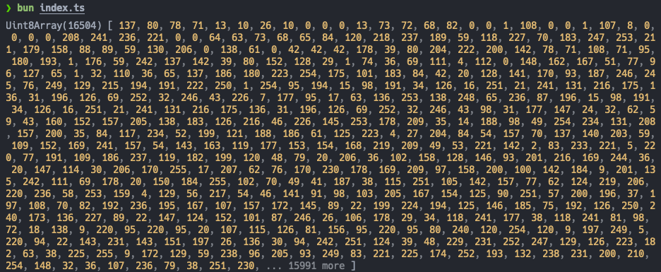

## 이미지 Layout Shift

제 블로그에서는 글의 이해를 돕기 위해 이미지를 사용하고 있는데요. 페이지 진입 시 혹은 새로고침 시에 Layout Shift가 발생하고 있었습니다.


이미지들을 `next/image`의 Image 태그로 처리해 놓았기 때문에 렌더링 시 이미지 크기만큼 영역을 잡아놔서 이런 문제가 없을 거로 생각했는데 아니었습니다.

```tsx img.tsx
const Img = (props: ImageProps) => {
  const caption = props?.title;
  const isUnoptimized = /.gif$/.test(props.src as string);

  return (
    <figure className="space-y-4">
      <Image
        {...props}
        // !mark(1:2)
        width={props.width || 0}
        height={props.height || 0}
        sizes="(max-width: 768px) 100vw, (max-width: 1200px) 80vw, 70vw"
        unoptimized={isUnoptimized}
      />
      {caption && <figcaption className="text-center text-sm text-mute">{caption}</figcaption>}
    </figure>
  );
};
```

당연히 있을 거라 예상했던 `props.width`와 `props.height`의 값이 존재하지 않았습니다.

```json
{
  className: 'mx-auto rounded',
  src: '/images/~/0.png',
  alt: '',
  title: '',
}
```

Next.js 공식 문서의 [Image Optimization - Local images](https://nextjs.org/docs/app/getting-started/images#local-images)를 보면 정적으로 import 한 이미지는 Next.js에서 변환해서 `StaticImageData` 객체로 만든다는 것을 알 수 있는데요. 이 경우에는 Next.js가 알아서 이미지의 사이즈를 읽어서 Layout Shift 문제가 발생하지 않게 됩니다.

하지만 제 블로그는 MDX에서 작성한 이미지를 직접 가져오기 때문에 Next.js 이미지 변환 파이프라인이 동작하지 않고, 위와 같은 정보들만 남게 됩니다. 그래서 현재와 같은 구조를 유지하기 위해서 직접 이미지 사이즈를 넣어주기로 했습니다.

## 플러그인으로 해결하기

MDX는 MDAST -> HAST 과정을 거쳐서 JSX로 변환되는데요. HAST에 위와 같은 객체 정보가 남아있고, 이때 트리를 순회하면서 `src`로 이미지를 불러와서 사이즈를 계산 후 추가해 줄 수 있습니다.

이 과정에 쉽게 개입하기 위해 `rehype` 플러그인을 구현했고, 이미지 사이즈 계산을 위해 [image-size](https://github.com/image-size/image-size) 라이브러리를 이용했습니다.

```js rehype-image-size.mjs
const rehypeImageSize = () => {
  return async (tree) => {
    const promises = [];

    visit(tree, 'element', (node) => {
      if (node.tagName !== 'img') return;

      const { src, width, height } = node.properties;

      if (src && !(width && height)) {
        const filePath = path.join(dir, src);

        const promise = (async () => {
          const buffer = await readFile(filePath);

          // !mark
          const dimensions = sizeOf(buffer);

          if (dimensions.width && dimensions.height) {
            // !mark(1:2)
            node.properties.width = dimensions.width;
            node.properties.height = dimensions.height;
          }
        })();

        promises.push(promise);
      }
    });

    await Promise.all(promises);
  };
};
```

이제 이 플러그인을 적용하면 아래와 같이 `props` 이미지의 `width`와 `height`가 추가된 게 보입니다.

```json
{
  className: 'mx-auto rounded',
  src: '/images/~/0.png',
  alt: '',
  title: '',
  // !mark(1:2)
  width: '634',
  height: '370'
}
```

그리고 더 이상 이미지로 인해 Layout Shift가 발생하지 않는 모습도 확인할 수 있습니다.


## image-size 라이브러리

그런데 손쉽게 이미지 사이즈를 구해준 [image-size](https://github.com/image-size/image-size) 라이브러리는 어떻게 동작하는 걸까요?

결론부터 이야기하자면 라이브러리는 이미지 파일을 읽고, 파일의 헤더를 분석해서 이미지의 사이즈를 추출합니다. 헤더를 분석 방법은 파일의 포맷에 따라 다양한 방법으로 구현되어 있습니다.

코드가 잘 분리되어 있어서 읽는 데 어려움은 없으실 텐데요. `v2.0.2` 기준으로 `lib`의 `fromFile -> lookup -> detector` 순으로 흐름을 따라가 봤습니다.

1. processQueue: 파일을 읽고, 바이너리 데이터를 [Uint8Array](https://developer.mozilla.org/ko/docs/Web/JavaScript/Reference/Global_Objects/Uint8Array)에 저장합니다.
2. detector: 바이너리 데이터에서 파일의 포맷을 추출합니다.
3. calculate: 포맷에 맞춰 헤더를 분석해서 이미지의 사이즈를 추출합니다.

생각보다 간단한 흐름인데요. 파일의 포맷을 추출하고, 헤더를 분석하는 과정이 재밌습니다.

## PNG 다뤄보기

라이브러리를 참고해서 제 블로그에서 가장 많이 사용하는 PNG 포맷의 사이즈를 계산해 보겠습니다.

우선 아무 PNG 포맷 이미지를 가져다가 바이너리 데이터를 찍어보면 아래처럼 보입니다.



아무 의미 없어 보이는 데이터 같은데요. PNG의 구조를 알고 나면 의미 있는 데이터로 변합니다.

### PNG 구조

[PNG SPEC v1.2](https://www.libpng.org/pub/png/spec/1.2/PNG-Contents.html) 문서를 보면 PNG 포맷의 자세한 스팩이 적혀있습니다.

**PNG file signature**

처음 8 byte에는 항상 아래와 같은 값(10진수)이 포함됩니다.

```txt
137 80 78 71 13 10 26 10
```

위 값을 [TextDecoder](https://developer.mozilla.org/en-US/docs/Web/API/TextDecoder)를 통해 UTF-8으로 디코드하면 아래와 같이 나타납니다.

```
�PNG\r\n\x1A\n
```

이 파일 서명을 통해 해당 파일이 PNG 포맷인지 알 수 있게 됩니다.

**Chunk layout**

이어서 여러 종류의 `Chunk`가 등장하는데요. 역할별로 구분되어 있습니다. 그리고 `Chunk`는 아래와 같이 구성되어 있습니다.

- Length(4 bytes): 데이터의 길이
- Chunk Type(4 bytes): 청크 종류(IHDR, IDAT, IEND, ...)
- Chunk Data(length bytes): 실제 데이터
- CRC(4 bytes): 오류 검사

구조를 시각화해 보면 이해가 더 쉽습니다.

```txt
[File Signature]
[Chunk #1]
  ├─ Length
  ├─ Chunk Type
  ├─ Chunk Data
  └─ CRC
[Chunk #2]
  ├─ Length
  ├─ Chunk Type
  ├─ Chunk Data
  └─ CRC
...
```

이제 `Chunk Type`을 식별하고, `Chunk Data`에서 정보를 가져올 수 있게 됩니다.

너비와 높이에 대한 정보는 `IHDR Chunk`의 데이터 안에 있습니다.

- Width(4 bytes)
- Height(4 bytes)
- Bit depth(1 byte)
- Color type(1 byte)
- Compression method(1 byte)
- Filter method(1 byte)
- Interlace method(1 byte)

> 참고로 `IHDR Chunk`는 `File signature` 뒤에 가장 먼저 등장합니다.
>
> "The IHDR chunk must appear FIRST."
>
> [4.1.1. IHDR Image header](https://www.libpng.org/pub/png/spec/1.2/PNG-Chunks.html)

### PNG 사이즈 계산하기

이제 위 구조를 실제 코드로 검증해 보겠습니다.

주어진 정보를 종합해서 PNG 이미지 사이즈를 구하는 여정을 정리하면 아래와 같습니다.

1. File signature가 PNG인지 검사
2. Chunk Type이 IHDR인지 검사
3. Width, Height 추출

이 여정을 아래와 같이 코드로 표현할 수 있습니다.

```ts
import * as fs from "node:fs";
import * as path from "node:path";

const process = async () => {
  const handle = await fs.promises.open(path.resolve("./image.png"), "r");
  const { size } = await handle.stat();
  const input = new Uint8Array(size);

  await handle.read(input, 0, size, 0);
  const imageSize = parser(input);
  await handle.close();

  return imageSize;
};

const pngSignature = "PNG\r\n\x1a\n";
const ihdrChunkType = "IHDR";

const parser = (input: Uint8Array) => {
  // File signature가 PNG인지 검사
  const signature = toUTF8String(input, 1, 8);
  if (signature !== pngSignature) return null;

  // Chunk Type이 IHDR인지 검사
  const chunk = toUTF8String(input, 12, 16);
  if (chunk !== ihdrChunkType) return null;

  // Width, Height 추출
  const size = {
    width: readUInt32BE(input, 16),
    height: readUInt32BE(input, 20),
  };

  return size;
};

/* Utility */
const toUTF8String = (input: Uint8Array, start: number, end: number) => {
  const decoder = new TextDecoder();
  return decoder.decode(input.slice(start, end));
};
const readUInt32BE = (input: Uint8Array, offset = 0) => {
  const view = new DataView(input.buffer, input.byteOffset + offset);
  return view.getUint32(0, false);
};

await process();
```

## 느낀점

블로그에서 발생한 Layout Shift를 해결하는 과정에서 이미지 포맷의 구조와 바이너리 데이터 해석까지 공부해 볼 수 있어서 즐거웠습니다.

또 이미지 포맷의 명확한 SPEC과 이를 지켜온 커뮤니티 덕분에 이미지 분석 라이브러리가 안정적으로 동작할 수 있었다고 느꼈습니다.

## 참고 자료

- [rehype-plugin Topics](https://github.com/topics/rehype-plugin)
- [PNG (Portable Network Graphics) Specification, Version 1.2](https://www.libpng.org/pub/png/spec/1.2/PNG-Contents.html)
