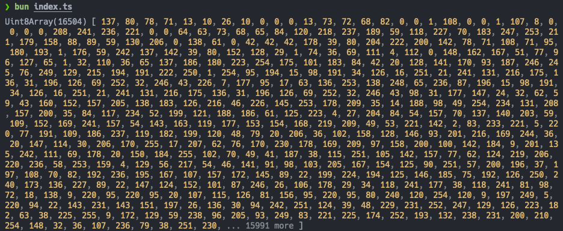

## image-size 라이브러리

[지난 글](/handle-mdx-image-size)에서 이미지 Layout Shift를 잡기 위해 [image-size](https://github.com/image-size/image-size) 라이브러리로 이미지 사이즈를 읽어 넣었다. 그런데 손쉽게 이미지 사이즈를 구해준 이 라이브러리는 어떻게 동작할까?

결론부터 이야기하자면 라이브러리는 이미지 파일을 읽고 파일의 헤더를 분석해서 이미지 사이즈를 추출한다. 헤더 분석 방법은 파일 포맷에 따라 다양하게 구현되어 있다.

코드가 잘 분리되어 있어서 읽는 데 어려움은 없을 것이다. `v2.0.2` 기준으로 `lib`의 `fromFile -> lookup -> detector` 순으로 흐름을 따라가 봤다.

1. processQueue: 파일을 읽고 바이너리 데이터를 [Uint8Array](https://developer.mozilla.org/ko/docs/Web/JavaScript/Reference/Global_Objects/Uint8Array)에 저장한다.
2. detector: 바이너리 데이터에서 파일 포맷을 추출한다.
3. calculate: 포맷에 맞춰 헤더를 분석해서 이미지 사이즈를 추출한다.

생각보다 간단한 흐름이다. 파일 포맷을 추출하고 헤더를 분석하는 과정이 재밌다.

## PNG 다뤄보기

라이브러리를 참고해서 내 블로그에서 가장 많이 사용하는 PNG 포맷의 사이즈를 계산해 보자.

우선 아무 PNG 포맷 이미지를 가져다가 바이너리 데이터를 찍어보면 아래처럼 보인다.



아무 의미 없어 보이는 데이터 같지만 PNG의 구조를 알고 나면 의미 있는 데이터로 변한다.

### PNG 구조

[PNG SPEC v1.2](https://www.libpng.org/pub/png/spec/1.2/PNG-Contents.html) 문서를 보면 PNG 포맷의 자세한 스펙이 적혀있다.

#### PNG file signature

처음 8 byte에는 항상 아래와 같은 값(10진수)이 포함된다.

```txt
137 80 78 71 13 10 26 10
```

16진수로 적으면 `89 50 4E 47 0D 0A 1A 0A`다.

위 값을 [TextDecoder](https://developer.mozilla.org/en-US/docs/Web/API/TextDecoder)를 통해 UTF-8으로 디코드하면 아래와 같이 나타난다.

```txt
�PNG\r\n\x1A\n
```

이 파일 서명을 통해 해당 파일이 PNG 포맷인지 알 수 있게 된다.

#### Chunk layout

이어서 여러 종류의 `Chunk`가 등장하는데, 역할별로 구분되어 있다. 그리고 `Chunk`는 아래와 같이 구성되어 있다.

- Length(4 bytes): 데이터의 길이
- Chunk Type(4 bytes): 청크 종류(IHDR, IDAT, IEND, ...)
- Chunk Data(length bytes): 실제 데이터
- CRC(4 bytes): 오류 검사

구조를 시각화해 보면 이해가 더 쉽다.

```txt
[File Signature]
[Chunk #1]
  ├─ Length
  ├─ Chunk Type
  ├─ Chunk Data
  └─ CRC
[Chunk #2]
  ├─ Length
  ├─ Chunk Type
  ├─ Chunk Data
  └─ CRC
...
```

이제 `Chunk Type`을 식별하고 `Chunk Data`에서 정보를 가져올 수 있게 된다.

너비와 높이에 대한 정보는 `IHDR Chunk`의 데이터 안에 있다.

- Width(4 bytes)
- Height(4 bytes)
- Bit depth(1 byte)
- Color type(1 byte)
- Compression method(1 byte)
- Filter method(1 byte)
- Interlace method(1 byte)

> 참고로 `IHDR Chunk`는 `File signature` 뒤에 가장 먼저 등장한다.
>
> "The IHDR chunk must appear FIRST."
>
> [4.1.1. IHDR Image header](https://www.libpng.org/pub/png/spec/1.2/PNG-Chunks.html)

### PNG 사이즈 계산하기

이제 위 구조를 실제 코드로 검증해 보자.

주어진 정보를 종합해서 PNG 이미지 사이즈를 구하는 과정을 정리하면 아래와 같다.

1. File signature가 PNG인지 검사
2. Chunk Type이 IHDR인지 검사
3. Width, Height 추출

이 과정을 아래와 같이 코드로 표현할 수 있다.

```ts
import * as fs from 'node:fs';
import * as path from 'node:path';

const process = async () => {
  const handle = await fs.promises.open(path.resolve('./image.png'), 'r');
  const { size } = await handle.stat();
  const input = new Uint8Array(size);

  await handle.read(input, 0, size, 0);
  const imageSize = parser(input);
  await handle.close();

  return imageSize;
};

const pngSignature = 'PNG\r\n\x1a\n';
const ihdrChunkType = 'IHDR';

const parser = (input: Uint8Array) => {
  // File signature가 PNG인지 검사
  const signature = toUTF8String(input, 1, 8);
  if (signature !== pngSignature) return null;

  // Chunk Type이 IHDR인지 검사
  const chunk = toUTF8String(input, 12, 16);
  if (chunk !== ihdrChunkType) return null;

  // Width, Height 추출
  const size = {
    width: readUInt32BE(input, 16),
    height: readUInt32BE(input, 20),
  };

  return size;
};

/* Utility */
const toUTF8String = (input: Uint8Array, start: number, end: number) => {
  const decoder = new TextDecoder();
  return decoder.decode(input.slice(start, end));
};
const readUInt32BE = (input: Uint8Array, offset = 0) => {
  const view = new DataView(input.buffer, input.byteOffset + offset);
  return view.getUint32(0, false);
};

await process();
```

## 마치며

블로그에서 발생한 Layout Shift를 해결하는 과정에서 이미지 포맷의 구조와 바이너리 데이터 해석까지 공부해 볼 수 있어서 즐거웠다.

또 이미지 포맷의 명확한 SPEC과 이를 지켜온 커뮤니티 덕분에 이미지 분석 라이브러리가 안정적으로 동작할 수 있었다고 느꼈다.

## 참고 자료

- [PNG (Portable Network Graphics) Specification, Version 1.2](https://www.libpng.org/pub/png/spec/1.2/PNG-Contents.html)
