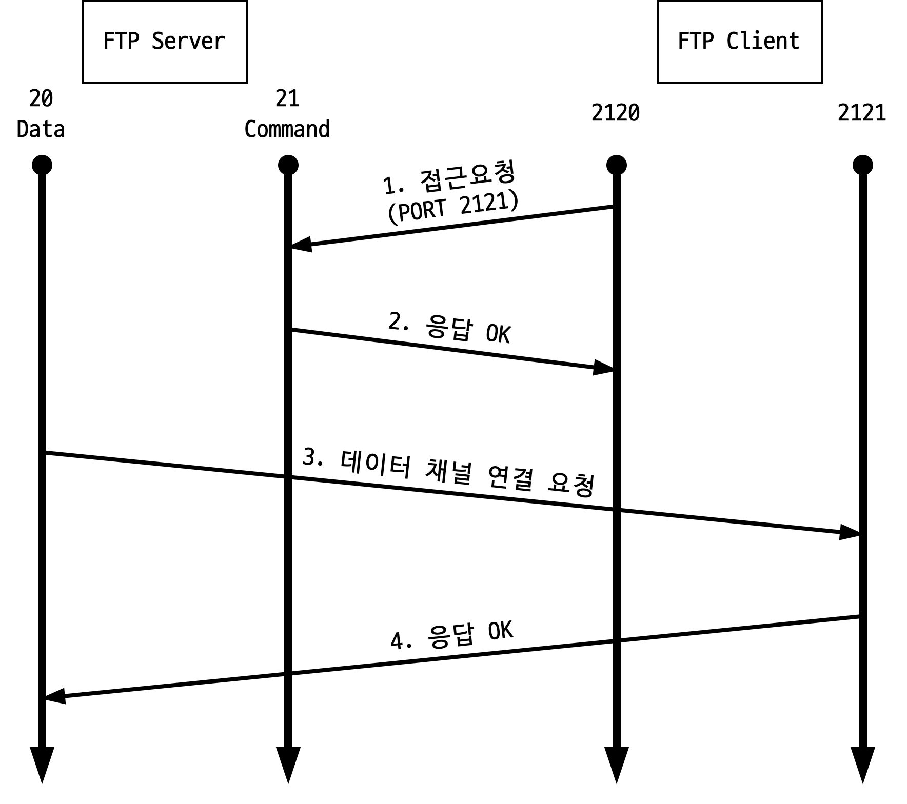
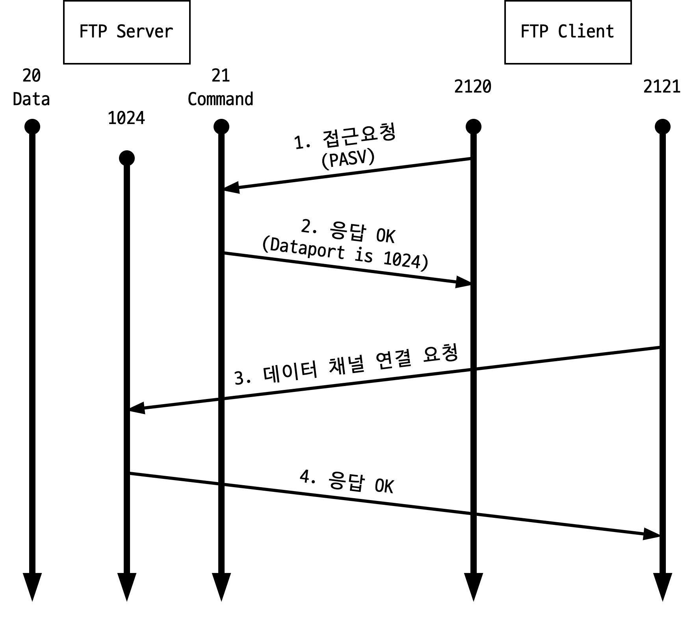
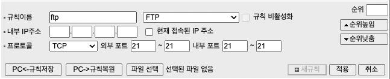
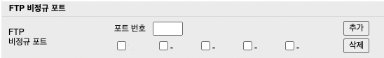

프로젝트를 하다가 FTP를 사용해서 내가 가진 게이트웨이에 파일을 보낼 일이 생겼다. FTP의 개념부터 클라이언트(NestJS)와 서버(ESL Gateway)를 연결하면서 내가 작업한 과정을 정리해보려고 한다.

FTP 관련 프로토콜로 FTPS, SFTP가 있지만 여기서는 FTP에 관해서만 다루려고 한다.

## FTP 란?

> 파일 전송 프로토콜(File Transfer Protocol, FTP)은 TCP/IP 프로토콜을 가지고 서버와 클라이언트 사이의 파일 전송을 하기 위한 프로토콜이다.

예전에는 많이 사용한 프로토콜이지만, 지금은 보안상의 위험으로 많이 사용하지 않는다. FTPS나 SFTP로 대체된 것 같다.

FTP는 두 가지 모드로 동작하는데 **Active Mode와 Passive Mode**다.



우선, Active Mode의 동작을 나타낸 그림인데 다음과 같은 순서로 동작한다.

1. 클라이언트가 서버의 21번 포트로 접속한 후, 클라이언트에서 사용할 포트를 알려준다.
2. 서버가 클라이언트의 요청에 응답한다.
3. 서버의 20번 포트가 클라이언트에서 알려준 포트로 접속한다.
4. 클라이언트가 서버의 요청에 응답한다.

그림에서 볼 수 있듯이 **서버에서 클라이언트에 접속**하는 구조다.

클라이언트에서 방화벽 등으로 외부 접속이 불가능한 상황이라면 접속이 불가능하고, 접속이 되더라도 정상적인 데이터 목록을 불러오지 못 할 수도 있다. 클라이언트는 방화벽 인바운드 허용, 서버는 방화벽 아웃바운드 허용을 통해서 해결해야 한다.



다음은 Passive Mode의 동작을 나타낸 그림인데 다음과 같은 순서로 동작한다.

1. 클라이언트가 서버의 21번 포트로 Passive 접속을 시도한다.
2. 서버에서 사용할 포트를 클라이언트에 알려준다.
3. 클라이언트는 서버에서 알려준 포트로 접속을 시도한다.
4. 서버가 클라이언트의 요청에 응답한다.

위에서 언급한 Active Mode와는 반대로 **클라이언트에서 서버에 접속**하는 구조다.

서버의 데이터 포트가 막혀 있는 경우 연결이 불가능하다. 데이터 포트의 범위는 별도로 지정하지 않는 경우 1024~65535번 포트를 사용하기 때문에 방화벽 인바운드를 모두 열어놔야 하는데, 데이터 포트의 범위를 지정해놓으면 이러한 문제를 어느 정도 해결할 수 있다고 한다.

## FTP Client (NestJS)

프로젝트에서 서버 스택은 `NestJS`를 사용했는데 일정 시간마다 ESL Gateway에 csv 파일을 FTP 통신을 통해서 보내야 했다.

```ts task.module.ts
import { FtpModule } from 'nestjs-ftp';

@Module({
  imports: [
    FtpModule.forRootFtpAsync({
      inject: [ConfigService],
      useFactory: (configService: ConfigService) => {
        return {
          host: configService.get('FTP_HOST'),
          port: configService.getNumber('FTP_PORT'),
          user: configService.get('FTP_USER'),
          password: configService.get('FTP_PASSWORD'),
          secure: configService.getBoolean('FTP_SECURE'),
        };
      },
    }),
  ]
})
```

내가 이용한 패키지는 `nestjs-ftp`다.

코드 상에서는 `.env` 환경 변수에서 설정 값을 읽어올 수 있도록 직접 구현한 `ConfigService`를 이용했지만 직접 입력해놔도 된다. 이렇게 클라이언트 설정이 끝나면 서비스 코드에서 파일을 보내주는 작업을 한다.

```ts task.service.ts
try {
  const response = await this.ftpService.upload(
    `${originPath}${file}`,
    `${destinationPath}${file}`
  );

  if (response.code === 226) this.loggerService.info('ftp success');
  else if (response.code === 0) this.loggerService.error('ftp failed');
  else this.loggerService.error('ftp unknown response');
} catch (error) {
  console.log(error);
}
```

우선 전송할 파일을 생성해준다. 이후 `upload(origin, destination)`를 이용해서 생성한 파일을 보내준다. nestjs-ftp는 응답으로 code와 message를 보내주는데 직접 확인해 보니 226이 오면 전송 성공, 0이 오면 전송 실패였다. 다른 코드가 오는 경우를 대비해서 예외 처리를 한 번 더 해줬다.

클라이언트 설정(연결)만 제대로 되면 큰 문제 없이 FTP를 통해서 파일을 전송할 수 있다.

## FTP Server (ESL Gateway)

ESL Gateway는 내가 직접 만든 서버는 아니고 FTP 포트 설정이 되어있는 상태로 받은 게이트웨이다. 다만, 외부에서 접속하기 때문에 공유기 포트 포워딩 설정을 해줬다.

내가 사용 중인 공유기는 ipTIME 이고, 포트 포워딩 설정은 다른 공유기들도 비슷할거라고 생각한다.

**ipTime 관리도구 -> 고급 설정 -> NAT/라우터 관리 -> 포트포워드 설정** 순으로 들어가준다.



이후 **새규칙 추가**를 통해서 외부 포트를 설정하고 FTP Server에 해당하는 내부 IP주소와 내부 포트를 설정해주면 된다.

## FTP Server가 비정규 포트를 사용하는 경우

일반적으로 위 과정까지 마무리하면 접속과 파일 송수신이 원활하게 이루어진다. 다만, 내가 ESL Gateway를 받았을 때 FTP 포트 설정이 21번 정규 포트가 아니라 다른 포트를 사용하는 비정규 포트로 되어있었다.

위에서 설명한 것처럼 FTP 통신 시에 21번 포트는 **Command** 포트이고, 20번 포트는 **Data** 포트다. 정해진 규약이기 때문에 일반적으로 공유기나 방화벽에서 21번 포트를 열면 20번 포트도 같이 열리게 된다.

하지만 비정규 포트를 사용하는 경우에는 **FTP 연결이 되어도 디렉토리와 파일 목록이 보이지 않거나 데이터를 전송할 수 없다.** 이를 해결하기 위해서 공유기에서 추가 작업을 해줘야 한다.

**ipTime 관리도구 -> 고급 설정 -> NAT/라우터 관리 -> 고급 NAT 설정 -> FTP 비정규 포트** 순으로 들어가준다.



이후 이미지처럼 사용하기를 원하는 비정규 포트를 추가해주면 정상적으로 사용이 가능하다.
