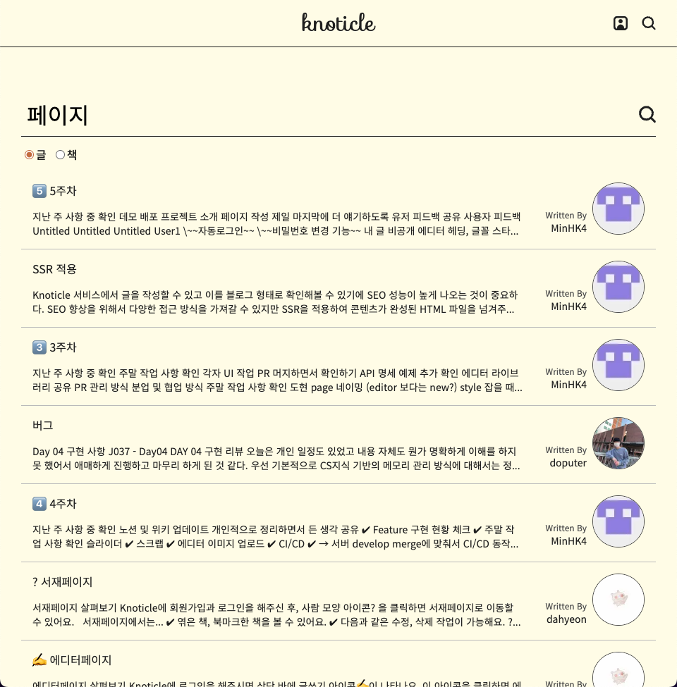
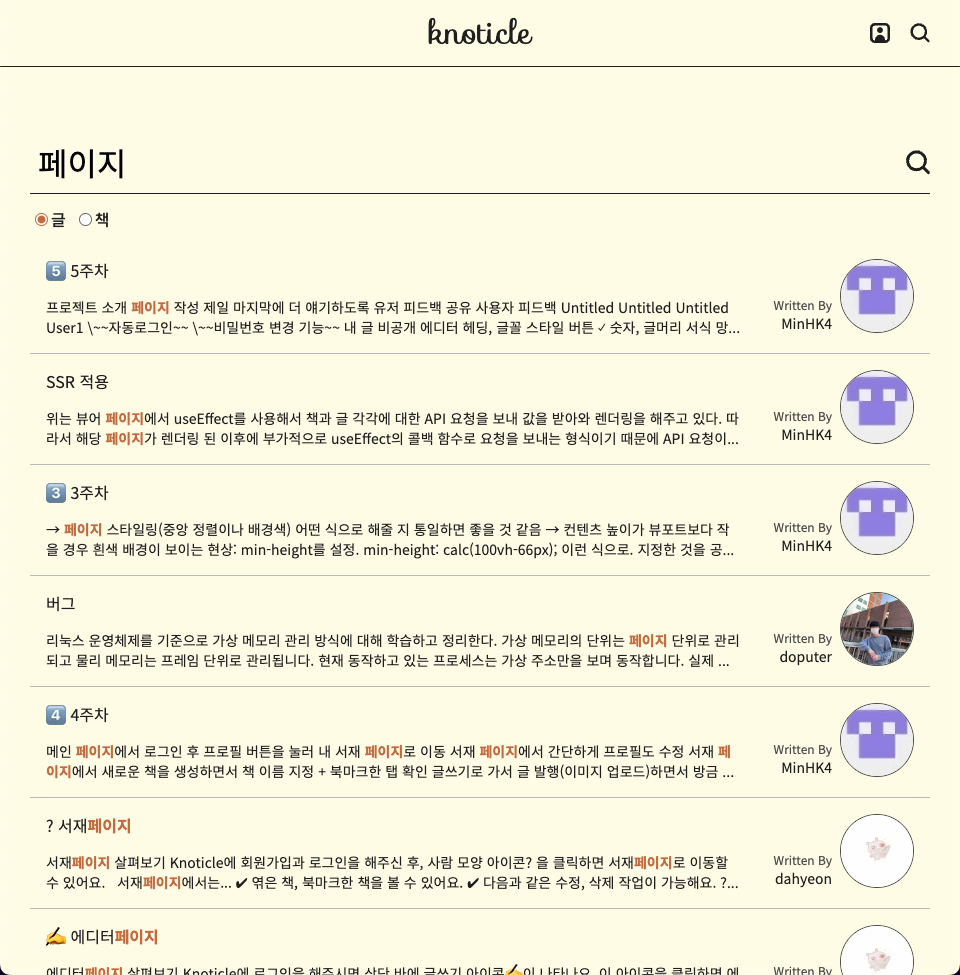
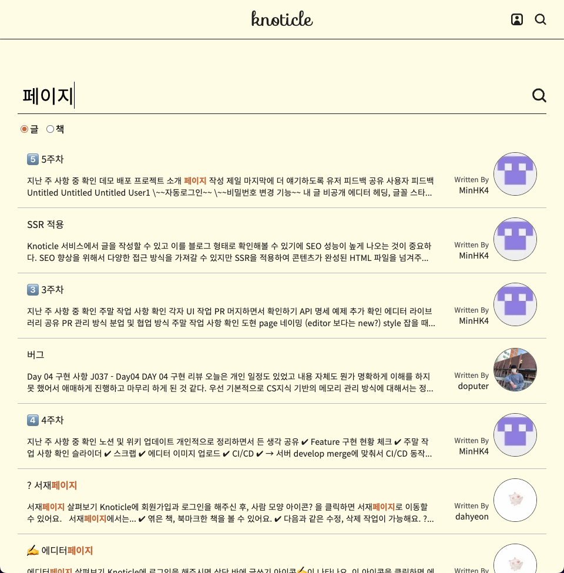

## 기존 Knoticle의 검색 결과

기존 [Knoticle](https://github.com/boostcampwm-2022/web01-knoticle) 서비스에서 "페이지" 라는 키워드로 검색한 결과입니다.



기존에는 검색 기능은 입력된 검색어를 포함하는 글의 제목과 내용을 모두 표시했습니다. 그러나 검색어가 글의 어떤 부분에 있는지 알 수 없어서 사용자가 검색 결과의 관련성을 파악하기 어려웠습니다.

이 문제를 해결하려고 **검색어 강조** 및 **검색어가 포함된 맥락의 표시** 기능을 추가하여 사용자에게 더 나은 검색 경험을 제공하고자 했습니다.



## 검색어 강조하기

글의 내용은 이런 형식으로 저장되어있습니다.

> 국토와 자원은 국가의 보호를 받으며, 국가는 그 균형있는 개발과 이용을 위하여 필요한 계획을 수립한다. 모든 국민은 통신의 비밀을 침해받지 아니한다. 감사원은 세입·세출의 결산을 매년 검사하여 대통령과 차년도국회에 그 결과를 보고하여야 한다. 대한민국은 민주공화국이다. 국가는 재해를 예방하고 그 위험으로부터 국민을 보호하기 위하여 노력하여야 한다.

이때 "국민" 과 "예방" 이라는 검색어로 검색한 경우에 어떤 식으로 해당 단어를 강조해줄 수 있을까요?

우선 문자열을 앞에서 부터 읽으면서 "국민" 과 "예방" 중에 먼저 등장하는 단어를 찾아야 합니다.

> ...
>
> 모든 **국민**은 통신의 비밀을 침해받지 아니한다.
>
> ...

코드로는 이렇게 작성했습니다.

```ts
const getFirstKeyword = (text: string, keywords: string[]) => {
  const keywordMap = new Map<number, string>();

  keywords.forEach((keyword) => {
    const index = text.toLowerCase().indexOf(keyword.toLowerCase());

    if (index !== -1) keywordMap.set(index, text.slice(index, index + keyword.length));
  });

  if (keywordMap.size === 0) return { keyword: '', index: -1, validKeywords: [] };

  const firstKeywordIndex = Math.min(...Array.from(keywordMap.keys()));
  const firstKeyword = keywordMap.get(firstKeywordIndex);

  return {
    keyword: firstKeyword || '',
    index: firstKeywordIndex,
    validKeywords: Array.from(new Set(keywordMap.values())),
  };
};
```

검색어들을 순회하면서 내용에서 가장 먼저 등장하는 인덱스를 구합니다. 그 후에 인덱스가 가장 낮은 단어(= 가장 앞에 등장하는 단어)를 찾습니다.

이때 영어 검색의 경우 대소문자 구분 없이 찾도록 `.toLowerCase()`를 이용합니다. 또한 한번 찾지 못한 검색어는 같은 문장에서 다시 등장하지 않기 때문에 `validKeywords`에 유효한 검색어만 필터링해서 같이 반환합니다.

가장 먼저 등장하는 단어를 찾았다면 그 단어를 기준으로 문장을 세 등분(단어 앞 문장, 단어, 단어 뒷 문장)으로 나눈 후 사이에 `<b> 태그`를 넣어서 강조합니다.

> ...
>
> 모든 \<b\>국민\</b\> 은 통신의 비밀을 침해받지 아니한다.
>
> ...

단어 하나를 강조했다면 단어 뒷 문장은 함수를 재귀 호출해서 반복적으로 강조합니다.

1. 가장 먼저 등장하는 검색어 찾기
2. 검색어를 기준으로 검색어 앞 문장, 검색어, 검색어 뒷 문장으로 나누기
3. 나눠진 문장 사이에 \<b\> 태그 추가하기
4. 검색어 뒷 문장에서 가장 먼저 등장하는 검색어 찾기
5. 반복

```ts
export const highlightKeyword = (text: string, keywords: string[]): React.ReactNode => {
  const { keyword, index, validKeywords } = getFirstKeyword(text, keywords);

  if (index === -1) return text;

  const endIndex = index + keyword.length;

  return (
    <>
      {text.slice(0, index)}
      <b>{keyword}</b>
      {highlightKeyword(text.slice(endIndex), validKeywords)}
    </>
  );
};
```

## 강조한 검색어가 보이지 않는 문제

검색어를 강조 이후에 일부 검색 결과에서는 검색어가 포함된 문장이 보이지 않는 문제가 있었습니다. 강조한 검색어가 문장 뒷 부분에 등장하면 검색 결과의 제한된 뷰포트에 가려졌기 때문입니다.



검색어가 포함된 문장을 보여주면 사용자는 자신의 검색어가 글의 어떤 맥락에서 등장하는지 쉽게 찾을 수 있습니다.

최초 검색어의 앞 부분을 제거해주면 해결됩니다.

> ~~국토와 자원은 국가의 보호를 받으며, 국가는 그 균형있는 개발과 이용을 위하여 필요한 계획을 수립한다.~~
>
> ~~모든~~ **국민**은 통신의 비밀을 침해받지 아니한다.
>
> ...

그런데 위와 같이 검색어 바로 앞쪽부터 지우면 검색어가 포함된 문장도 지워지기 때문에 사용자가 맥락을 파악하기 힘들어집니다.

검색어가 포함된 문장은 살리되 그 앞쪽은 모두 지우려면 줄바꿈 문자를 이용하면 됩니다. 검색어가 포함된 문장에서 가장 가까운 줄바꿈 문자를 찾아 그 앞쪽을 지우면 앞서 말한 문제들이 해결됩니다.

> ~~국토와 자원은 국가의 보호를 받으며, 국가는 그 균형있는 개발과 이용을 위하여 필요한 계획을 수립한다.~~**\n**
>
> 모든 **국민**은 통신의 비밀을 침해받지 아니한다.
>
> ...

함수 구현은 이렇습니다.

환경에 따라 다르지만 뷰포트에는 최대 400자 정도가 들어올 수 있기 때문에 불필요한 뒷 부분도 함께 제거해줬습니다.

```ts
export const getTextAfterLastNewLine = (text: string, keywords: string[]) => {
  const { index } = getFirstKeyword(text, keywords);

  const newLineIndex = text.slice(0, index).lastIndexOf('\n');

  return newLineIndex === -1 ? text.slice(0, 400) : text.slice(newLineIndex, newLineIndex + 400);
};
```
