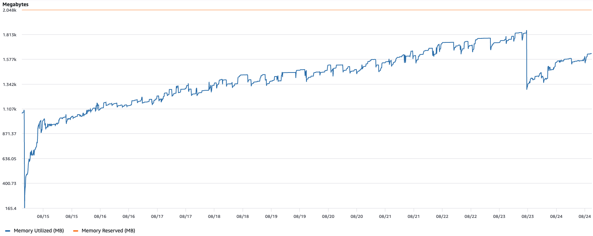
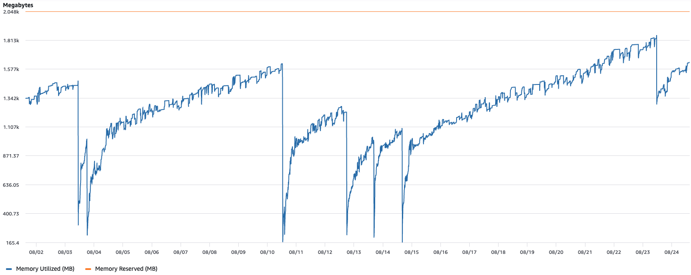
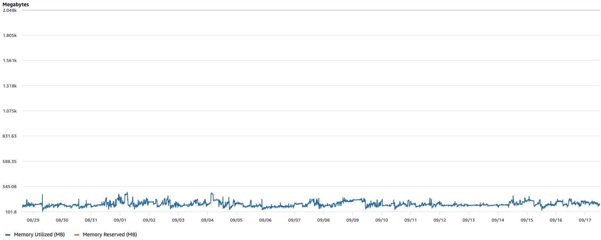

운영 중인 서비스의 메모리 그래프가 계단을 올라가고 있었다. 트래픽이 몰리면 한 칸씩 오르고 트래픽이 빠져도 내려오지 않다가, 배포로 프로세스가 새로 뜨는 순간에만 바닥으로 돌아가 같은 계단을 다시 오르기 시작했다.



처음에는 특정 날짜부터 시작된 문제로 보고 그 시점을 찾는 데서 출발했는데, 이 전제부터 먼저 무너졌다. 더 오래된 구간까지 거슬러 올라가 봐도 그래프는 이미 같은 기울기로 오르고 있었기 때문이다.

그동안 문제로 불거지지 않았던 이유는 배포에 있었다. 배포가 잦으면 프로세스가 자주 새로 뜨고 그때마다 메모리가 바닥으로 돌아가니, 계단은 줄곧 그려지고 있었어도 끝까지 올라갈 시간을 얻지 못했던 것이다.

전형적인 메모리 누수 그래프다. 그런데 결론부터 말하면 누수가 아니었다. 코드에서 새는 곳은 없었고 힙 스냅샷에도 잡히는 것이 없었는데, 그럼에도 프로세스가 쓰는 물리 메모리는 계속 늘어만 갔다. 이 글은 그 원인을 찾아가는 과정과, 찾고 난 뒤에야 알게 된 것들을 정리한 기록이다.

## 첫 번째 가설, 깊은 복사

용의자는 금방 떠올랐다. 프로젝트에는 직접 만든 병합 함수가 있었는데, 요청마다 중첩 객체를 깊은 복사해 가며 합쳤다. 스프레드로 새 객체를 만들고 값이 객체면 재귀로 다시 들어가 또 새 객체를 만드는 식이라, 호출 한 번마다 원본과 구조가 같은 객체 트리가 통째로 하나씩 더 생겼다.

병합 대상은 i18n 메시지 객체였다. 최상위 키는 10여 개뿐이었지만 리프 노드는 로케일당 1,000개 안팎, 중첩 깊이는 5단계에 달했고, 이 병합이 요청 하나마다 세 번씩 일어났다.

복사된 객체가 어딘가에 붙잡혀 GC되지 않는다면 그래프는 정확히 이런 모양이 된다. 그럴듯했다. 가설을 세웠다.

> 깊은 복사가 일어나는 경로에 요청을 몰아주면 RSS가 비례해서 오르고, 요청을 멈춰도 내려오지 않을 것이다.

검증은 k6로 했다. 깊은 복사가 일어나는 엔드포인트만 골라 부하를 주고 전후의 RSS를 비교하는 식이었다.

```js load.js
import http from 'k6/http';

export const options = {
  vus: 50,
  duration: '5m',
};

export default function () {
  http.post('http://localhost:3000/api/...', JSON.stringify(payload));
}
```

결과는 예상과 달랐다. 부하 중에 RSS가 오르긴 했지만 부하가 끝나면 원래 수준으로 돌아왔다.

힙도 들여다봤다. Next.js 서버를 `--inspect`로 띄워 부팅 직후와, 부하가 끝나고 GC가 한 차례 지난 뒤의 스냅샷을 비교해 보니 두 스냅샷의 크기 차이는 거의 없었고 늘어난 객체도 보이지 않았다. GC는 제 할 일을 하고 있었다. 깊은 복사는 비용이 큰 코드였지만 새는 코드는 아니었다.

첫 가설은 기각이다. 남은 후보는 두 개, GC가 손대지 못하는 데이터가 어딘가에 쌓이고 있거나 애초에 컨테이너에 준 메모리가 이 워크로드에 비해 작은 것이었다.

그런데 이 실험에서 더 중요한 단서가 나왔다. 로컬에서는 어떤 부하를 줘도 운영 환경의 그래프가 재현되지 않는다.

## 로컬과 운영의 차이

재현이 안 된다면 코드보다 환경을 볼 차례라, 로컬과 운영 사이에 다른 점을 하나씩 적어봤다.

- 로컬은 macOS, 운영은 Linux 컨테이너다.
- 로컬은 개발 서버, 운영은 프로덕션 빌드다.
- 이미지 처리는 `sharp`가 맡는다. `next build`가 쓸 수 있게 의존성에 넣어둔 것이라 개발과 스테이징에도 같이 들어 있다.

세 번째가 눈에 걸렸다. 찾아보니 sharp는 내부적으로 libvips라는 C 라이브러리를 쓰는데, 자바스크립트 힙 바깥에서 메모리를 쓰는 유일한 모듈이었다. 힙 스냅샷에 아무것도 안 잡히던 것과도 맞아떨어졌다. V8 힙에 없는 메모리는 애초에 힙 스냅샷에 나올 수가 없기 때문이다.

sharp는 개발과 스테이징에도 있었지만 거기서는 아무 일도 없었다. 그렇다면 두 환경에는 없고 운영에만 있는 것을 찾아야 했는데, 동시에 들어오는 트래픽과 배포 사이에 프로세스가 오래 살아 있는 시간이었다. 계단은 이 둘이 겹쳐야만 그려진다.

두 번째 가설을 세웠다.

> RSS 증가는 V8 힙이 아니라 libvips가 쓰는 네이티브 메모리에서 일어난다.

## 두 번째 가설, sharp

이번에는 회사 코드를 빼고 sharp만 남긴 재현 환경을 Docker로 만들었다. 운영과 같은 조건을 맞추려고 베이스 이미지는 glibc 기반의 `node:24-slim`을 썼다.

부하는 단순했다. 2000×2000 노이즈 이미지를 만들어 JPEG로 인코딩하고 다시 400×400으로 리사이즈해 인코딩하는 작업을 32개씩 `Promise.all`로 동시에 돌리면서 배치마다 RSS를 기록했다.

```js index.js
const fs = require('fs');
const sharp = require('sharp');

const CONCURRENCY = Number(process.env.CONCURRENCY || 32);
const SIZE = 2000;

function readVmRssMb() {
  const status = fs.readFileSync('/proc/self/status', 'utf8');
  const line = status.split('\n').find((l) => l.startsWith('VmRSS'));
  return (Number(line.replace(/\D+/g, '')) / 1024).toFixed(1);
}

async function processOnce() {
  const buf = await sharp({
    create: {
      width: SIZE,
      height: SIZE,
      channels: 3,
      noise: { type: 'gaussian', mean: 128, sigma: 30 },
    },
  })
    .jpeg()
    .toBuffer();

  await sharp(buf).resize(400, 400).jpeg({ quality: 80 }).toBuffer();
}

const start = Date.now();
console.log('elapsed_s,vmrss_mb');

async function loop() {
  for (;;) {
    await Promise.all(Array.from({ length: CONCURRENCY }, processOnce));
    const elapsed = ((Date.now() - start) / 1000).toFixed(1);
    console.log(`${elapsed},${readVmRssMb()}`);
    await new Promise((r) => setTimeout(r, 200));
  }
}

loop();
```

```dockerfile Dockerfile
FROM node:24-slim
WORKDIR /app
COPY package.json .
RUN npm install
COPY index.js .
CMD ["node", "index.js"]
```

결과는 운영 그래프와 같은 모양이었다. 아래는 그 첫 1분의 기록이다.

:::mermaid

xychart-beta
title "RSS (MB)"
x-axis "경과(초)" [6, 12, 18, 24, 30, 36, 42, 48, 54, 60]
y-axis 200 --> 450
line [261, 297, 334, 359, 358, 364, 372, 361, 385, 399]

:::

시작 직후 261MB였던 RSS는 20초 만에 350MB를 넘고 1분이 되기 전에 400MB 근처까지 올라간다. 부하는 매 배치 똑같은 일을 반복할 뿐이고 처리가 끝난 이미지 버퍼는 매번 버려지며 자바스크립트 쪽에서 붙잡고 있는 것도 없는데도 그렇다.

같은 코드를 macOS에서 돌리면 RSS는 첫 배치 이후 거의 움직이지 않는다. 문제는 sharp가 새는 게 아니라 **Linux에서 sharp가 메모리를 쓰는 방식**에 있었다.

## sharp 문서가 이미 알고 있었다

원인을 좁혀놓고 sharp 문서를 다시 읽어 보니 설치 페이지에 Linux memory allocator[^1]라는 항목이 있었다.

> The default memory allocator on most glibc-based Linux systems (e.g. Debian, Red Hat) is unsuitable for long-running, multi-threaded processes that involve lots of small memory allocations.
>
> For this reason, by default, sharp will limit the use of thread-based concurrency when the glibc allocator is detected at runtime.
>
> To help avoid fragmentation and improve performance on these systems, the use of an alternative memory allocator such as jemalloc is recommended.
>
> Those using musl-based Linux (e.g. Alpine) and non-Linux systems are unaffected.

증상이 그대로 적혀 있었다. glibc 기반 Linux, 오래 실행되는 멀티스레드 프로세스, 잦은 작은 할당, 그리고 macOS와 Alpine은 영향이 없다는 말까지. 로컬에서 재현되지 않은 것도 로컬이 macOS였기 때문이다.

해결책도 문서에 있었다. glibc의 malloc 대신 jemalloc을 쓰는 것이었고 코드는 한 줄도 바꾸지 않고 Dockerfile만 고치면 됐다.

```dockerfile Dockerfile
FROM node:24-slim

RUN apt-get update && apt-get install -y --no-install-recommends libjemalloc2 \
  && ln -s "$(dpkg -L libjemalloc2 | grep -m1 'libjemalloc\.so\.2$')" /usr/local/lib/libjemalloc.so.2 \
  && rm -rf /var/lib/apt/lists/*

ENV LD_PRELOAD=/usr/local/lib/libjemalloc.so.2
```

`LD_PRELOAD`는 환경 변수로, 여기에 적힌 공유 라이브러리는 프로세스가 시작될 때 다른 라이브러리보다 먼저 로드된다. jemalloc이 `malloc`과 `free`를 먼저 정의해 두면 이후 로드되는 glibc의 것은 가려지므로, Node.js도 libvips도 자기가 어떤 할당자를 쓰는지 모른 채 jemalloc을 쓰게 된다.

`.so` 파일이 설치되는 경로는 아키텍처마다 달라서 amd64는 `x86_64-linux-gnu`, arm64는 `aarch64-linux-gnu` 아래로 들어간다. 경로를 박아두면 다른 아키텍처에서 빌드했을 때 로더가 경고 한 줄만 남기고 glibc malloc으로 조용히 돌아가 버린다. 고친 줄 알고 넘어가기 쉬운 실패다. 그래서 `dpkg -L`로 패키지가 파일을 어디에 뒀는지 직접 물어보고 고정된 경로로 심링크를 걸었다.

jemalloc을 올리고 같은 부하를 5분 동안 다시 돌렸다.

:::mermaid

xychart-beta
title "RSS (MB, jemalloc)"
x-axis "경과(초)" [3, 20, 40, 61, 80, 100, 119, 139, 159, 179, 198, 217, 239, 259, 280, 300]
y-axis 400 --> 650
line [472, 518, 569, 531, 551, 609, 549, 557, 587, 537, 527, 543, 549, 544, 607, 524]

:::

RSS는 시작 직후부터 500MB 안팎에서 출렁일 뿐, 5분 내내 우상향하는 구간이 없다. glibc 기본값이었다면 이미 계단 두세 칸은 올라가 있어야 할 시간이다.



계단이 사라졌고 운영에 배포한 뒤의 그래프도 마찬가지였다. 문제는 해결됐다. 그런데 이대로 끝내면 "glibc가 나쁘고 jemalloc이 좋다" 정도만 남는데, 왜 glibc의 malloc은 멀티스레드에서 메모리를 놓지 않는지, 그리고 그게 왜 누수처럼 보이는지가 궁금했다.

## free는 메모리를 돌려주지 않는다

`free()`를 호출해도 물리 메모리는 운영체제로 곧장 돌아가지 않는다.

`malloc()`은 커널에서 직접 메모리를 받아오지 않는다. 시스템 콜은 비용이 크기 때문에 할당자는 커널에서 큼직한 영역을 미리 받아두고 그 안에서 작은 조각을 잘라 나눠주는데, `free()`는 그 조각을 "다시 쓸 수 있음"으로 표시할 뿐이라 조각이 깔고 있던 물리 페이지는 그대로 프로세스 소유로 남는다.

물리 페이지를 실제로 커널에 돌려주려면 할당자가 별도의 시스템 콜을 해야 한다.

- `brk()`로 힙의 끝을 낮추거나
- `munmap()`으로 매핑된 영역을 통째로 해제하거나
- `madvise(MADV_DONTNEED)`로 특정 페이지의 회수를 요청해야 한다

:::mermaid

sequenceDiagram
participant A as 애플리케이션
participant M as glibc malloc
participant K as 커널
A->>M: free(ptr)
M->>M: free-list에 표시
Note over M: 물리 페이지는 그대로 프로세스 소유
alt 힙 꼭대기 빈 공간 > 128KB
M->>K: brk() 또는 madvise()
K-->>M: 페이지 회수, RSS 감소
else 그 외
M-->>A: 반환, RSS 변화 없음
end

:::

glibc는 이 작업을 힙 꼭대기에 연속된 빈 공간이 128KB(`M_TRIM_THRESHOLD`)를 넘을 때만 하고 힙 중간에 낀 빈 조각은 아무리 커도 반납 대상으로 보지 않는다.[^2] 그래서 살아있는 작은 할당 하나가 꼭대기 근처에 남아 있기만 해도 그 아래 빈 공간은 전부 프로세스가 물고 있게 된다.

이것이 "새지 않는 누수"의 정체다. 논리적으로는 모두 해제됐지만 물리적으로는 하나도 돌아가지 않은 것이다.

## arena, 스레드마다 힙을 나누는 이유

여기까지는 단일 스레드에서도 일어나는 이야기고 glibc의 malloc이 멀티스레드에서 유독 메모리를 많이 쥐는 이유는 따로 있다. arena다.[^3]

힙은 여러 스레드가 동시에 건드리면 깨지는 자료구조라 락이 필요하다. 힙 하나에 락 하나뿐이면 스레드가 많아질수록 `malloc` 앞에 줄이 길게 늘어선다. glibc는 이 문제를 힙을 여러 개로 쪼개는 방식으로 풀었다. 이렇게 쪼개진 힙 하나와 그 힙 전용 락, 전용 free-list를 묶어 **arena**라고 부른다.

- 프로세스가 시작되면 main arena 하나만 있다.
- 어떤 스레드가 `malloc`을 부르는데 arena가 다른 스레드에 잠겨 있으면, glibc는 그 스레드에게 **새 arena를 만들어 준다**. `mmap()`으로 확보한 별도의 영역이다.
- arena 개수는 64비트 기준 코어 수 × 8까지 늘어난다. `MALLOC_ARENA_MAX`로 바꿀 수 있다.
- 한번 만들어진 arena는 재사용되지만 거의 파괴되지 않는다.

:::mermaid

flowchart TD
A["스레드가 malloc() 호출"] --> B(["마지막에 쓴 arena가 잠겨 있나?"])
B -->|아니오| C["그 arena에서 할당"]
B -->|예| D(["arena 개수가 상한 미만인가?"])
D -->|예| E["mmap()으로 새 arena 생성"]
D -->|아니오| F["다른 arena를 찾아 락 대기"]

:::

libvips는 이미지 하나를 처리할 때도 자체 스레드 풀을 쓰는데, 여기에 요청 32개가 동시에 들어오면 수십 개의 스레드가 짧은 시간에 `malloc`과 `free`를 쏟아낸다. 경합이 잦으니 그만큼 arena도 계속 늘어난다.

arena가 N개면 프로세스 메모리는 **arena 각각의 최고 수위의 합**에 수렴한다. 각 arena가 자기 꼭대기 아래의 빈 공간을 놓지 않기 때문이다. 트래픽이 한 번 몰려 각 arena의 수위가 올라가면 트래픽이 빠져도 수위는 그대로 남고 그래프는 거기서 계단 한 칸을 올라간 채로 있다.

이 설명이 맞다면 arena 개수를 묶어두는 것만으로도 그래프가 달라져야 한다. 같은 재현 코드에 `MALLOC_ARENA_MAX=2`만 걸어서 5분씩 다시 돌리고, 두 실험의 기록을 겹쳐 그렸다. 위쪽 선(Line 1)이 glibc 기본값, 아래쪽 선(Line 2)이 `MALLOC_ARENA_MAX=2`다.

:::mermaid

xychart-beta
title "RSS (MB)"
x-axis "경과(초)" [3, 20, 40, 61, 80, 100, 119, 139, 159, 179, 198, 217, 239, 259, 280, 300]
y-axis 200 --> 450
line [261, 334, 372, 399, 379, 389, 393, 397, 391, 383, 380, 405, 406, 400, 401, 399]
line [234, 317, 348, 336, 334, 343, 356, 338, 355, 345, 358, 363, 339, 339, 359, 360]

:::

기본값은 1분 안팎에 400MB 근처로 올라선 뒤 그 근방에서 더 오르지 않는 반면, arena를 2개로 제한한 쪽은 그보다 40MB 가량 낮은 350MB 근처에서 오르내리기만 하고 계단을 오르지 않는다. 코드도, 부하도, 이미지도 같은데 달라진 것은 할당자가 힙을 몇 개로 쪼개는지뿐이다.

기본값 그래프가 1분 안팎에서 이미 평평해진 것은 arena 개수가 상한(코어 수 × 8)에 금방 닿았기 때문이다. 로컬 컨테이너에 배정된 코어 수가 적어 상한 자체가 낮고, 그만큼 빨리 도달한다. 상한에 닿으면 더는 새 arena가 생기지 않고 각 arena의 수위도 워크로드의 최고점에서 더 오르지 않는다. 운영 환경에서는 코어 수도 더 많고 트래픽 패턴이 매일 다르니 이 상한이 훨씬 늦게, 훨씬 높은 곳에서 나타난다.

:::callout

sharp는 이 문제를 알고 있어서, 런타임에 glibc 할당자가 감지되면 libvips 스레드 풀 크기(`sharp.concurrency()`)를 1로 제한한다. 그래도 요청이 동시에 여러 개 들어오면 파이프라인마다 스레드가 생기므로 경합 자체는 사라지지 않는다.

:::

재현 코드에서 동시성이 핵심이었던 것도 같은 이유인데, 32개를 순차로 처리하면 경합이 거의 없어 arena가 늘지 않고 그래프도 평평하게 나온다.

## 이것을 파편화라고 불러야 할까

sharp 문서는 이 현상을 fragmentation이라고 부른다. 엄밀히 보면 두 가지가 겹쳐 있다.

1. **arena 증식.** 락 경합을 피하려고 의도적으로 메모리를 나눠 쓰는 트레이드오프다. 파편화라기보다 설계상의 비용이다.
2. **arena 안의 파편화.** 살아있는 작은 할당이 힙 중간에 끼어 그 아래 빈 공간을 반납할 수 없게 만든다. "빈 공간은 있는데 쓸 수 없다"는 고전적인 외부 파편화다.

관찰된 RSS 증가는 1번으로 총량이 늘고, 2번으로 늘어난 것이 줄지 않은 결과다.

## jemalloc은 무엇이 다른가

jemalloc도 arena를 쓰지만 결과가 다른 이유는 arena를 만드는 기준과 메모리를 돌려주는 방식 자체가 다르기 때문이다.[^4]

- arena 개수를 처음부터 코어 수에 비례해 고정하고, 스레드를 라운드 로빈으로 배정한다. 경합이 생겼다고 arena를 새로 만들지 않는다.
- 할당을 크기 등급(size class)별로 묶어 관리해 같은 크기의 조각이 한곳에 모인다. 서로 다른 크기가 섞여 구멍이 나는 파편화가 덜하다.
- 비어 있는 페이지를 힙 꼭대기 여부와 상관없이 `madvise()`로 주기적으로 커널에 돌려준다. glibc의 트림이 꼭대기에서만 일어나는 것과 다르다.

고정된 arena는 프로세스가 시작되자마자 한꺼번에 만들어진다. 앞서 재현 실험에서 jemalloc 쪽 RSS가 처음부터 glibc 쪽보다 높은 값(472MB 대 261MB)에서 시작했던 것도 이 때문이다. glibc는 arena를 필요할 때만 하나씩 늘리니 가볍게 출발해서 끝없이 오르고, jemalloc은 무겁게 출발하지만 그 언저리에서 오르내리기만 한다.

:::mermaid

flowchart TB
subgraph glibc
direction LR
G1["free()"] --> G2(["힙 꼭대기 빈 공간이 128KB를 넘나?"])
G2 -->|예| G3["brk()로 꼭대기 반납"]
G2 -->|아니오| G4["보유, RSS 유지"]
end
subgraph jemalloc
direction LR
J1["free()"] --> J2(["비어 있는 페이지가 있나?"])
J2 -->|예| J3["decay 주기마다 madvise()로 반납"]
J2 -->|아니오| J4["보유"]
end

:::

정리하면 glibc는 "힙 꼭대기가 비었을 때만" 돌려주고, jemalloc은 "비어 있는 페이지라면" 돌려준다. libvips는 큰 버퍼와 작은 메타데이터를 섞어서 쉴 새 없이 할당하고 해제한다. 그런 워크로드에서 이 차이는 그대로 RSS 그래프에 찍힌다.

## Alpine은 왜 영향이 없나

sharp 문서는 musl 기반의 Alpine은 영향이 없다고 적었다. musl의 malloc(mallocng)은 설계 자체가 다르기 때문이다.[^5] 스레드마다 arena를 만드는 개념이 없고 경합은 더 잘게 쪼갠 크기별 slab과 세밀한 락으로 줄인다. slab이 처음부터 `mmap()` 단위라서 완전히 비면 바로 `munmap()`으로 반납하는 경향도 강하다.

musl에도 파편화는 있다. 다만 "스레드 수만큼 힙이 복제되어 각자 최고 수위를 물고 놓지 않는" glibc 특유의 패턴이 성립하지 않을 뿐이다.

그래서 베이스 이미지를 Alpine으로 바꾸는 것도 선택지다. 다만 sharp의 네이티브 바이너리가 musl에서 정상 동작하는지, 다른 네이티브 모듈은 없는지 확인이 필요해서 이번에는 jemalloc을 택했다.

## RSS는 무엇을 재는가

처음부터 그래프에 그려지고 있던 숫자는 다름 아닌 RSS였다.

`malloc()`이 성공한 순간 물리 메모리가 소비되는 것은 아니다. 커널은 "이 가상 주소 범위는 네 것"이라고 장부에 적어둘 뿐이고 그 주소를 실제로 읽거나 쓰는 순간에야 페이지 폴트가 나면서 물리 페이지가 배정된다. 지금 물리 RAM에 올라와 있는 페이지의 합이 RSS다.

| 지표 | 의미                                                                  |
| ---- | --------------------------------------------------------------------- |
| VSZ  | 프로세스가 예약한 가상 주소 공간 전체. 손대지 않은 mmap 영역까지 포함 |
| RSS  | 지금 물리 RAM에 올라와 있는 페이지의 합. 스왑된 페이지는 제외         |
| PSS  | 공유 페이지의 비용을 공유하는 프로세스 수로 나눠 계산한 값            |
| USS  | 다른 프로세스와 공유하지 않는 이 프로세스만의 메모리                  |

`free()`가 RSS를 줄이지 않는 이유는 앞에서 본 것과 같다. 논리적 반환과 물리적 반납은 별개의 단계이고 후자는 할당자가 커널에 직접 요청해야만 일어나기 때문이다. RSS는 할당자가 커널에 돌려주지 않은 것까지 전부 세므로, RSS가 오르는 것과 애플리케이션이 메모리를 새게 하는 것은 같은 말이 아니다.

## 다른 선택지

jemalloc 외에도 완화 방법은 있고 상황에 따라 더 맞는 것을 고를 수 있다.

- `MALLOC_ARENA_MAX=2`: glibc를 그대로 쓰면서 arena 개수만 제한한다. 위 그래프에서 본 것처럼 계단은 막지만 수위 자체가 낮아지지는 않고, 경합이 늘어 처리량이 떨어질 수 있다.
- `sharp.concurrency(n)` 또는 `VIPS_CONCURRENCY`: libvips 스레드 풀 크기를 직접 제한한다.
- `sharp.cache(false)`: libvips의 연산 캐시를 끈다. 캐시가 버퍼를 붙들고 있는 것이 원인이라면 이걸로 줄어들지만, arena 문제와는 별개 메커니즘이라 효과는 따로 확인해야 한다.
- Alpine(musl) 베이스 이미지로 교체.
- 메모리 리밋과 주기적 재시작. 근본 해결은 아니고 증상 관리다.

## 마치며

:::mermaid

flowchart LR
A["계단식 RSS 증가"] --> H1
subgraph H1["가설 1: 깊은 복사 누수"]
direction TB
B["k6 부하 테스트"] --> C["부하 후 RSS 복귀"]
C --> D["기각"]
end
H1 --> H2
subgraph H2["가설 2: sharp의 네이티브 메모리"]
direction TB
E["로컬 미재현, 환경 차이"] --> F["Docker에서 재현"]
F --> G["sharp 문서: glibc 할당자"]
end
H2 --> I["jemalloc 적용"]

:::

첫 가설은 틀렸지만 그 실험이 없었으면 "로컬에서는 재현이 안 된다"는 단서를 얻지 못했을 것이다. 코드를 의심하다 환경을 의심하게 됐고, 환경을 좁히다 할당자까지 내려갔다.

메모리 그래프가 오른다고 해서 코드가 새는 것은 아니다. 힙 스냅샷이 깨끗한데 RSS만 오른다면 그 아래 층을 봐야 한다. 그 아래 층에는 `malloc`이 있고, `malloc`은 생각보다 많은 것을 결정한다.

[^1]: [sharp - Installation - Linux memory allocator](https://sharp.pixelplumbing.com/install/#linux-memory-allocator)

[^2]: [glibc - Malloc Tunables](https://sourceware.org/glibc/manual/latest/html_node/Memory-Allocation-Tunables.html)

[^3]: [glibc - malloc/arena.c](https://sourceware.org/git/?p=glibc.git;a=blob;f=malloc/arena.c)

[^4]: [jemalloc](https://github.com/jemalloc/jemalloc)

[^5]: [musl - mallocng](https://git.musl-libc.org/cgit/musl/tree/src/malloc/mallocng)
